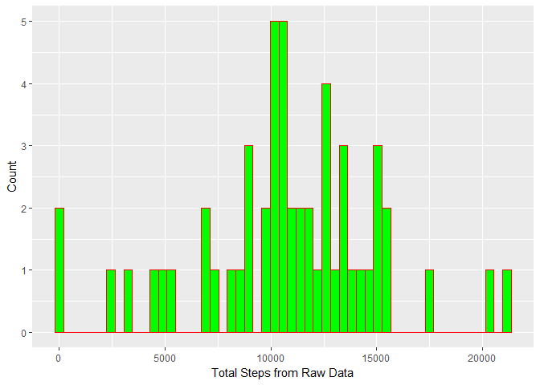
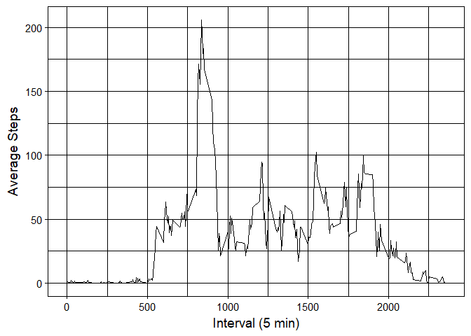
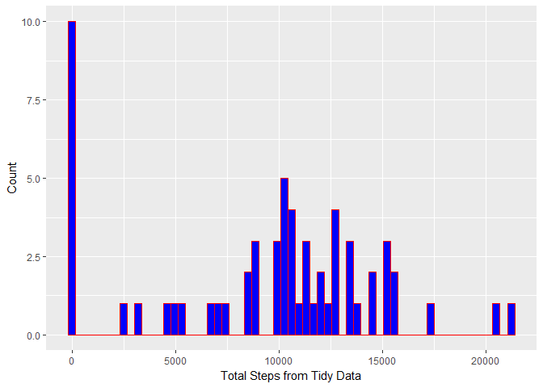
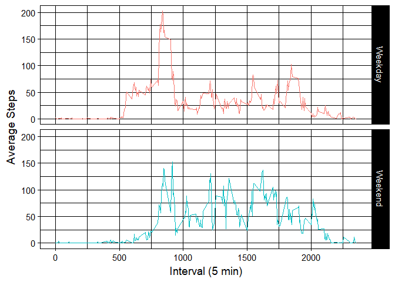

# Reproducible Research: Peer Assessment 1

## Loading and preprocessing the data

```r
if (!dir.exists("data")) {
    dir.create("data")
}
unzip("activity.zip", exdir = "data")

activity_data <- read.csv("data/activity.csv")

library(dplyr)
library(ggplot2)
library(huxtable)
library(chron)
```

## Histogram of total number of steps taken in a day in the raw data

```r
activity_summary <- activity_data %>%
    mutate_if(is.factor, as.Date) %>%
    group_by(date) %>%
    filter(!is.na(steps)) %>%
    summarise(total_steps = sum(steps, na.rm = TRUE))

print(qplot(activity_summary$total_steps,
    geom = "histogram",
    bins = nrow(activity_summary),
    xlab = "Total Steps from Raw Data",
    ylab = "Count",
    col = I("red"),
    fill = I("green")))
```

<!-- -->

## What is mean and median of the total number of steps taken per day in the raw data?

```r
steps_table <- activity_data %>%
    mutate_if(is.factor, as.character) %>%
    group_by(date) %>%
    filter(!is.na(steps)) %>%
    summarise(mean_steps = mean(steps),
		median_steps = median(steps)) %>%
	select(Date = date, Mean = mean_steps, Median = median_steps)

as_hux(steps_table, add_colnames = TRUE) %>%
    set_bold(1,, TRUE) %>%
    set_bottom_border(1,, 1) %>%
	set_right_border(1, 1:2, 1) %>%
	set_align(,2:3, "center")
```

<!--html_preserve--><table class="huxtable" style="border-collapse: collapse; width: 50%; margin-left: auto; margin-right: auto;">
<col style="width: NA;"><col style="width: NA;"><col style="width: NA;"><tr>
  <td  style="vertical-align: top; text-align: left; white-space: nowrap; border-width:0px 1px 1px 0px; border-style: solid; border-top-color: NA;  border-right-color: NA;  border-bottom-color: NA;  border-left-color: NA; padding: 4pt 4pt 4pt 4pt; "><span style="font-weight: bold; ">Date</span></td>
  <td  style="vertical-align: top; text-align: center; white-space: nowrap; border-width:0px 1px 1px 0px; border-style: solid; border-top-color: NA;  border-right-color: NA;  border-bottom-color: NA;  border-left-color: NA; padding: 4pt 4pt 4pt 4pt; "><span style="font-weight: bold; ">Mean</span></td>
  <td  style="vertical-align: top; text-align: center; white-space: nowrap; border-width:0px 0px 1px 0px; border-style: solid; border-top-color: NA;  border-right-color: NA;  border-bottom-color: NA;  border-left-color: NA; padding: 4pt 4pt 4pt 4pt; "><span style="font-weight: bold; ">Median</span></td>
</tr>
<tr>
  <td  style="vertical-align: top; text-align: left; white-space: nowrap; border-width:0px 0px 0px 0px; border-style: solid; border-top-color: NA;  border-right-color: NA;  border-bottom-color: NA;  border-left-color: NA; padding: 4pt 4pt 4pt 4pt; ">2012-10-02</td>
  <td  style="vertical-align: top; text-align: center; white-space: nowrap; border-width:0px 0px 0px 0px; border-style: solid; border-top-color: NA;  border-right-color: NA;  border-bottom-color: NA;  border-left-color: NA; padding: 4pt 4pt 4pt 4pt; "> 0.44</td>
  <td  style="vertical-align: top; text-align: center; white-space: nowrap; border-width:0px 0px 0px 0px; border-style: solid; border-top-color: NA;  border-right-color: NA;  border-bottom-color: NA;  border-left-color: NA; padding: 4pt 4pt 4pt 4pt; "> 0.00</td>
</tr>
<tr>
  <td  style="vertical-align: top; text-align: left; white-space: nowrap; border-width:0px 0px 0px 0px; border-style: solid; border-top-color: NA;  border-right-color: NA;  border-bottom-color: NA;  border-left-color: NA; padding: 4pt 4pt 4pt 4pt; ">2012-10-03</td>
  <td  style="vertical-align: top; text-align: center; white-space: nowrap; border-width:0px 0px 0px 0px; border-style: solid; border-top-color: NA;  border-right-color: NA;  border-bottom-color: NA;  border-left-color: NA; padding: 4pt 4pt 4pt 4pt; ">39.42</td>
  <td  style="vertical-align: top; text-align: center; white-space: nowrap; border-width:0px 0px 0px 0px; border-style: solid; border-top-color: NA;  border-right-color: NA;  border-bottom-color: NA;  border-left-color: NA; padding: 4pt 4pt 4pt 4pt; "> 0.00</td>
</tr>
<tr>
  <td  style="vertical-align: top; text-align: left; white-space: nowrap; border-width:0px 0px 0px 0px; border-style: solid; border-top-color: NA;  border-right-color: NA;  border-bottom-color: NA;  border-left-color: NA; padding: 4pt 4pt 4pt 4pt; ">2012-10-04</td>
  <td  style="vertical-align: top; text-align: center; white-space: nowrap; border-width:0px 0px 0px 0px; border-style: solid; border-top-color: NA;  border-right-color: NA;  border-bottom-color: NA;  border-left-color: NA; padding: 4pt 4pt 4pt 4pt; ">42.07</td>
  <td  style="vertical-align: top; text-align: center; white-space: nowrap; border-width:0px 0px 0px 0px; border-style: solid; border-top-color: NA;  border-right-color: NA;  border-bottom-color: NA;  border-left-color: NA; padding: 4pt 4pt 4pt 4pt; "> 0.00</td>
</tr>
<tr>
  <td  style="vertical-align: top; text-align: left; white-space: nowrap; border-width:0px 0px 0px 0px; border-style: solid; border-top-color: NA;  border-right-color: NA;  border-bottom-color: NA;  border-left-color: NA; padding: 4pt 4pt 4pt 4pt; ">2012-10-05</td>
  <td  style="vertical-align: top; text-align: center; white-space: nowrap; border-width:0px 0px 0px 0px; border-style: solid; border-top-color: NA;  border-right-color: NA;  border-bottom-color: NA;  border-left-color: NA; padding: 4pt 4pt 4pt 4pt; ">46.16</td>
  <td  style="vertical-align: top; text-align: center; white-space: nowrap; border-width:0px 0px 0px 0px; border-style: solid; border-top-color: NA;  border-right-color: NA;  border-bottom-color: NA;  border-left-color: NA; padding: 4pt 4pt 4pt 4pt; "> 0.00</td>
</tr>
<tr>
  <td  style="vertical-align: top; text-align: left; white-space: nowrap; border-width:0px 0px 0px 0px; border-style: solid; border-top-color: NA;  border-right-color: NA;  border-bottom-color: NA;  border-left-color: NA; padding: 4pt 4pt 4pt 4pt; ">2012-10-06</td>
  <td  style="vertical-align: top; text-align: center; white-space: nowrap; border-width:0px 0px 0px 0px; border-style: solid; border-top-color: NA;  border-right-color: NA;  border-bottom-color: NA;  border-left-color: NA; padding: 4pt 4pt 4pt 4pt; ">53.54</td>
  <td  style="vertical-align: top; text-align: center; white-space: nowrap; border-width:0px 0px 0px 0px; border-style: solid; border-top-color: NA;  border-right-color: NA;  border-bottom-color: NA;  border-left-color: NA; padding: 4pt 4pt 4pt 4pt; "> 0.00</td>
</tr>
<tr>
  <td  style="vertical-align: top; text-align: left; white-space: nowrap; border-width:0px 0px 0px 0px; border-style: solid; border-top-color: NA;  border-right-color: NA;  border-bottom-color: NA;  border-left-color: NA; padding: 4pt 4pt 4pt 4pt; ">2012-10-07</td>
  <td  style="vertical-align: top; text-align: center; white-space: nowrap; border-width:0px 0px 0px 0px; border-style: solid; border-top-color: NA;  border-right-color: NA;  border-bottom-color: NA;  border-left-color: NA; padding: 4pt 4pt 4pt 4pt; ">38.25</td>
  <td  style="vertical-align: top; text-align: center; white-space: nowrap; border-width:0px 0px 0px 0px; border-style: solid; border-top-color: NA;  border-right-color: NA;  border-bottom-color: NA;  border-left-color: NA; padding: 4pt 4pt 4pt 4pt; "> 0.00</td>
</tr>
<tr>
  <td  style="vertical-align: top; text-align: left; white-space: nowrap; border-width:0px 0px 0px 0px; border-style: solid; border-top-color: NA;  border-right-color: NA;  border-bottom-color: NA;  border-left-color: NA; padding: 4pt 4pt 4pt 4pt; ">2012-10-09</td>
  <td  style="vertical-align: top; text-align: center; white-space: nowrap; border-width:0px 0px 0px 0px; border-style: solid; border-top-color: NA;  border-right-color: NA;  border-bottom-color: NA;  border-left-color: NA; padding: 4pt 4pt 4pt 4pt; ">44.48</td>
  <td  style="vertical-align: top; text-align: center; white-space: nowrap; border-width:0px 0px 0px 0px; border-style: solid; border-top-color: NA;  border-right-color: NA;  border-bottom-color: NA;  border-left-color: NA; padding: 4pt 4pt 4pt 4pt; "> 0.00</td>
</tr>
<tr>
  <td  style="vertical-align: top; text-align: left; white-space: nowrap; border-width:0px 0px 0px 0px; border-style: solid; border-top-color: NA;  border-right-color: NA;  border-bottom-color: NA;  border-left-color: NA; padding: 4pt 4pt 4pt 4pt; ">2012-10-10</td>
  <td  style="vertical-align: top; text-align: center; white-space: nowrap; border-width:0px 0px 0px 0px; border-style: solid; border-top-color: NA;  border-right-color: NA;  border-bottom-color: NA;  border-left-color: NA; padding: 4pt 4pt 4pt 4pt; ">34.38</td>
  <td  style="vertical-align: top; text-align: center; white-space: nowrap; border-width:0px 0px 0px 0px; border-style: solid; border-top-color: NA;  border-right-color: NA;  border-bottom-color: NA;  border-left-color: NA; padding: 4pt 4pt 4pt 4pt; "> 0.00</td>
</tr>
<tr>
  <td  style="vertical-align: top; text-align: left; white-space: nowrap; border-width:0px 0px 0px 0px; border-style: solid; border-top-color: NA;  border-right-color: NA;  border-bottom-color: NA;  border-left-color: NA; padding: 4pt 4pt 4pt 4pt; ">2012-10-11</td>
  <td  style="vertical-align: top; text-align: center; white-space: nowrap; border-width:0px 0px 0px 0px; border-style: solid; border-top-color: NA;  border-right-color: NA;  border-bottom-color: NA;  border-left-color: NA; padding: 4pt 4pt 4pt 4pt; ">35.78</td>
  <td  style="vertical-align: top; text-align: center; white-space: nowrap; border-width:0px 0px 0px 0px; border-style: solid; border-top-color: NA;  border-right-color: NA;  border-bottom-color: NA;  border-left-color: NA; padding: 4pt 4pt 4pt 4pt; "> 0.00</td>
</tr>
<tr>
  <td  style="vertical-align: top; text-align: left; white-space: nowrap; border-width:0px 0px 0px 0px; border-style: solid; border-top-color: NA;  border-right-color: NA;  border-bottom-color: NA;  border-left-color: NA; padding: 4pt 4pt 4pt 4pt; ">2012-10-12</td>
  <td  style="vertical-align: top; text-align: center; white-space: nowrap; border-width:0px 0px 0px 0px; border-style: solid; border-top-color: NA;  border-right-color: NA;  border-bottom-color: NA;  border-left-color: NA; padding: 4pt 4pt 4pt 4pt; ">60.35</td>
  <td  style="vertical-align: top; text-align: center; white-space: nowrap; border-width:0px 0px 0px 0px; border-style: solid; border-top-color: NA;  border-right-color: NA;  border-bottom-color: NA;  border-left-color: NA; padding: 4pt 4pt 4pt 4pt; "> 0.00</td>
</tr>
<tr>
  <td  style="vertical-align: top; text-align: left; white-space: nowrap; border-width:0px 0px 0px 0px; border-style: solid; border-top-color: NA;  border-right-color: NA;  border-bottom-color: NA;  border-left-color: NA; padding: 4pt 4pt 4pt 4pt; ">2012-10-13</td>
  <td  style="vertical-align: top; text-align: center; white-space: nowrap; border-width:0px 0px 0px 0px; border-style: solid; border-top-color: NA;  border-right-color: NA;  border-bottom-color: NA;  border-left-color: NA; padding: 4pt 4pt 4pt 4pt; ">43.15</td>
  <td  style="vertical-align: top; text-align: center; white-space: nowrap; border-width:0px 0px 0px 0px; border-style: solid; border-top-color: NA;  border-right-color: NA;  border-bottom-color: NA;  border-left-color: NA; padding: 4pt 4pt 4pt 4pt; "> 0.00</td>
</tr>
<tr>
  <td  style="vertical-align: top; text-align: left; white-space: nowrap; border-width:0px 0px 0px 0px; border-style: solid; border-top-color: NA;  border-right-color: NA;  border-bottom-color: NA;  border-left-color: NA; padding: 4pt 4pt 4pt 4pt; ">2012-10-14</td>
  <td  style="vertical-align: top; text-align: center; white-space: nowrap; border-width:0px 0px 0px 0px; border-style: solid; border-top-color: NA;  border-right-color: NA;  border-bottom-color: NA;  border-left-color: NA; padding: 4pt 4pt 4pt 4pt; ">52.42</td>
  <td  style="vertical-align: top; text-align: center; white-space: nowrap; border-width:0px 0px 0px 0px; border-style: solid; border-top-color: NA;  border-right-color: NA;  border-bottom-color: NA;  border-left-color: NA; padding: 4pt 4pt 4pt 4pt; "> 0.00</td>
</tr>
<tr>
  <td  style="vertical-align: top; text-align: left; white-space: nowrap; border-width:0px 0px 0px 0px; border-style: solid; border-top-color: NA;  border-right-color: NA;  border-bottom-color: NA;  border-left-color: NA; padding: 4pt 4pt 4pt 4pt; ">2012-10-15</td>
  <td  style="vertical-align: top; text-align: center; white-space: nowrap; border-width:0px 0px 0px 0px; border-style: solid; border-top-color: NA;  border-right-color: NA;  border-bottom-color: NA;  border-left-color: NA; padding: 4pt 4pt 4pt 4pt; ">35.20</td>
  <td  style="vertical-align: top; text-align: center; white-space: nowrap; border-width:0px 0px 0px 0px; border-style: solid; border-top-color: NA;  border-right-color: NA;  border-bottom-color: NA;  border-left-color: NA; padding: 4pt 4pt 4pt 4pt; "> 0.00</td>
</tr>
<tr>
  <td  style="vertical-align: top; text-align: left; white-space: nowrap; border-width:0px 0px 0px 0px; border-style: solid; border-top-color: NA;  border-right-color: NA;  border-bottom-color: NA;  border-left-color: NA; padding: 4pt 4pt 4pt 4pt; ">2012-10-16</td>
  <td  style="vertical-align: top; text-align: center; white-space: nowrap; border-width:0px 0px 0px 0px; border-style: solid; border-top-color: NA;  border-right-color: NA;  border-bottom-color: NA;  border-left-color: NA; padding: 4pt 4pt 4pt 4pt; ">52.38</td>
  <td  style="vertical-align: top; text-align: center; white-space: nowrap; border-width:0px 0px 0px 0px; border-style: solid; border-top-color: NA;  border-right-color: NA;  border-bottom-color: NA;  border-left-color: NA; padding: 4pt 4pt 4pt 4pt; "> 0.00</td>
</tr>
<tr>
  <td  style="vertical-align: top; text-align: left; white-space: nowrap; border-width:0px 0px 0px 0px; border-style: solid; border-top-color: NA;  border-right-color: NA;  border-bottom-color: NA;  border-left-color: NA; padding: 4pt 4pt 4pt 4pt; ">2012-10-17</td>
  <td  style="vertical-align: top; text-align: center; white-space: nowrap; border-width:0px 0px 0px 0px; border-style: solid; border-top-color: NA;  border-right-color: NA;  border-bottom-color: NA;  border-left-color: NA; padding: 4pt 4pt 4pt 4pt; ">46.71</td>
  <td  style="vertical-align: top; text-align: center; white-space: nowrap; border-width:0px 0px 0px 0px; border-style: solid; border-top-color: NA;  border-right-color: NA;  border-bottom-color: NA;  border-left-color: NA; padding: 4pt 4pt 4pt 4pt; "> 0.00</td>
</tr>
<tr>
  <td  style="vertical-align: top; text-align: left; white-space: nowrap; border-width:0px 0px 0px 0px; border-style: solid; border-top-color: NA;  border-right-color: NA;  border-bottom-color: NA;  border-left-color: NA; padding: 4pt 4pt 4pt 4pt; ">2012-10-18</td>
  <td  style="vertical-align: top; text-align: center; white-space: nowrap; border-width:0px 0px 0px 0px; border-style: solid; border-top-color: NA;  border-right-color: NA;  border-bottom-color: NA;  border-left-color: NA; padding: 4pt 4pt 4pt 4pt; ">34.92</td>
  <td  style="vertical-align: top; text-align: center; white-space: nowrap; border-width:0px 0px 0px 0px; border-style: solid; border-top-color: NA;  border-right-color: NA;  border-bottom-color: NA;  border-left-color: NA; padding: 4pt 4pt 4pt 4pt; "> 0.00</td>
</tr>
<tr>
  <td  style="vertical-align: top; text-align: left; white-space: nowrap; border-width:0px 0px 0px 0px; border-style: solid; border-top-color: NA;  border-right-color: NA;  border-bottom-color: NA;  border-left-color: NA; padding: 4pt 4pt 4pt 4pt; ">2012-10-19</td>
  <td  style="vertical-align: top; text-align: center; white-space: nowrap; border-width:0px 0px 0px 0px; border-style: solid; border-top-color: NA;  border-right-color: NA;  border-bottom-color: NA;  border-left-color: NA; padding: 4pt 4pt 4pt 4pt; ">41.07</td>
  <td  style="vertical-align: top; text-align: center; white-space: nowrap; border-width:0px 0px 0px 0px; border-style: solid; border-top-color: NA;  border-right-color: NA;  border-bottom-color: NA;  border-left-color: NA; padding: 4pt 4pt 4pt 4pt; "> 0.00</td>
</tr>
<tr>
  <td  style="vertical-align: top; text-align: left; white-space: nowrap; border-width:0px 0px 0px 0px; border-style: solid; border-top-color: NA;  border-right-color: NA;  border-bottom-color: NA;  border-left-color: NA; padding: 4pt 4pt 4pt 4pt; ">2012-10-20</td>
  <td  style="vertical-align: top; text-align: center; white-space: nowrap; border-width:0px 0px 0px 0px; border-style: solid; border-top-color: NA;  border-right-color: NA;  border-bottom-color: NA;  border-left-color: NA; padding: 4pt 4pt 4pt 4pt; ">36.09</td>
  <td  style="vertical-align: top; text-align: center; white-space: nowrap; border-width:0px 0px 0px 0px; border-style: solid; border-top-color: NA;  border-right-color: NA;  border-bottom-color: NA;  border-left-color: NA; padding: 4pt 4pt 4pt 4pt; "> 0.00</td>
</tr>
<tr>
  <td  style="vertical-align: top; text-align: left; white-space: nowrap; border-width:0px 0px 0px 0px; border-style: solid; border-top-color: NA;  border-right-color: NA;  border-bottom-color: NA;  border-left-color: NA; padding: 4pt 4pt 4pt 4pt; ">2012-10-21</td>
  <td  style="vertical-align: top; text-align: center; white-space: nowrap; border-width:0px 0px 0px 0px; border-style: solid; border-top-color: NA;  border-right-color: NA;  border-bottom-color: NA;  border-left-color: NA; padding: 4pt 4pt 4pt 4pt; ">30.63</td>
  <td  style="vertical-align: top; text-align: center; white-space: nowrap; border-width:0px 0px 0px 0px; border-style: solid; border-top-color: NA;  border-right-color: NA;  border-bottom-color: NA;  border-left-color: NA; padding: 4pt 4pt 4pt 4pt; "> 0.00</td>
</tr>
<tr>
  <td  style="vertical-align: top; text-align: left; white-space: nowrap; border-width:0px 0px 0px 0px; border-style: solid; border-top-color: NA;  border-right-color: NA;  border-bottom-color: NA;  border-left-color: NA; padding: 4pt 4pt 4pt 4pt; ">2012-10-22</td>
  <td  style="vertical-align: top; text-align: center; white-space: nowrap; border-width:0px 0px 0px 0px; border-style: solid; border-top-color: NA;  border-right-color: NA;  border-bottom-color: NA;  border-left-color: NA; padding: 4pt 4pt 4pt 4pt; ">46.74</td>
  <td  style="vertical-align: top; text-align: center; white-space: nowrap; border-width:0px 0px 0px 0px; border-style: solid; border-top-color: NA;  border-right-color: NA;  border-bottom-color: NA;  border-left-color: NA; padding: 4pt 4pt 4pt 4pt; "> 0.00</td>
</tr>
<tr>
  <td  style="vertical-align: top; text-align: left; white-space: nowrap; border-width:0px 0px 0px 0px; border-style: solid; border-top-color: NA;  border-right-color: NA;  border-bottom-color: NA;  border-left-color: NA; padding: 4pt 4pt 4pt 4pt; ">2012-10-23</td>
  <td  style="vertical-align: top; text-align: center; white-space: nowrap; border-width:0px 0px 0px 0px; border-style: solid; border-top-color: NA;  border-right-color: NA;  border-bottom-color: NA;  border-left-color: NA; padding: 4pt 4pt 4pt 4pt; ">30.97</td>
  <td  style="vertical-align: top; text-align: center; white-space: nowrap; border-width:0px 0px 0px 0px; border-style: solid; border-top-color: NA;  border-right-color: NA;  border-bottom-color: NA;  border-left-color: NA; padding: 4pt 4pt 4pt 4pt; "> 0.00</td>
</tr>
<tr>
  <td  style="vertical-align: top; text-align: left; white-space: nowrap; border-width:0px 0px 0px 0px; border-style: solid; border-top-color: NA;  border-right-color: NA;  border-bottom-color: NA;  border-left-color: NA; padding: 4pt 4pt 4pt 4pt; ">2012-10-24</td>
  <td  style="vertical-align: top; text-align: center; white-space: nowrap; border-width:0px 0px 0px 0px; border-style: solid; border-top-color: NA;  border-right-color: NA;  border-bottom-color: NA;  border-left-color: NA; padding: 4pt 4pt 4pt 4pt; ">29.01</td>
  <td  style="vertical-align: top; text-align: center; white-space: nowrap; border-width:0px 0px 0px 0px; border-style: solid; border-top-color: NA;  border-right-color: NA;  border-bottom-color: NA;  border-left-color: NA; padding: 4pt 4pt 4pt 4pt; "> 0.00</td>
</tr>
<tr>
  <td  style="vertical-align: top; text-align: left; white-space: nowrap; border-width:0px 0px 0px 0px; border-style: solid; border-top-color: NA;  border-right-color: NA;  border-bottom-color: NA;  border-left-color: NA; padding: 4pt 4pt 4pt 4pt; ">2012-10-25</td>
  <td  style="vertical-align: top; text-align: center; white-space: nowrap; border-width:0px 0px 0px 0px; border-style: solid; border-top-color: NA;  border-right-color: NA;  border-bottom-color: NA;  border-left-color: NA; padding: 4pt 4pt 4pt 4pt; "> 8.65</td>
  <td  style="vertical-align: top; text-align: center; white-space: nowrap; border-width:0px 0px 0px 0px; border-style: solid; border-top-color: NA;  border-right-color: NA;  border-bottom-color: NA;  border-left-color: NA; padding: 4pt 4pt 4pt 4pt; "> 0.00</td>
</tr>
<tr>
  <td  style="vertical-align: top; text-align: left; white-space: nowrap; border-width:0px 0px 0px 0px; border-style: solid; border-top-color: NA;  border-right-color: NA;  border-bottom-color: NA;  border-left-color: NA; padding: 4pt 4pt 4pt 4pt; ">2012-10-26</td>
  <td  style="vertical-align: top; text-align: center; white-space: nowrap; border-width:0px 0px 0px 0px; border-style: solid; border-top-color: NA;  border-right-color: NA;  border-bottom-color: NA;  border-left-color: NA; padding: 4pt 4pt 4pt 4pt; ">23.53</td>
  <td  style="vertical-align: top; text-align: center; white-space: nowrap; border-width:0px 0px 0px 0px; border-style: solid; border-top-color: NA;  border-right-color: NA;  border-bottom-color: NA;  border-left-color: NA; padding: 4pt 4pt 4pt 4pt; "> 0.00</td>
</tr>
<tr>
  <td  style="vertical-align: top; text-align: left; white-space: nowrap; border-width:0px 0px 0px 0px; border-style: solid; border-top-color: NA;  border-right-color: NA;  border-bottom-color: NA;  border-left-color: NA; padding: 4pt 4pt 4pt 4pt; ">2012-10-27</td>
  <td  style="vertical-align: top; text-align: center; white-space: nowrap; border-width:0px 0px 0px 0px; border-style: solid; border-top-color: NA;  border-right-color: NA;  border-bottom-color: NA;  border-left-color: NA; padding: 4pt 4pt 4pt 4pt; ">35.14</td>
  <td  style="vertical-align: top; text-align: center; white-space: nowrap; border-width:0px 0px 0px 0px; border-style: solid; border-top-color: NA;  border-right-color: NA;  border-bottom-color: NA;  border-left-color: NA; padding: 4pt 4pt 4pt 4pt; "> 0.00</td>
</tr>
<tr>
  <td  style="vertical-align: top; text-align: left; white-space: nowrap; border-width:0px 0px 0px 0px; border-style: solid; border-top-color: NA;  border-right-color: NA;  border-bottom-color: NA;  border-left-color: NA; padding: 4pt 4pt 4pt 4pt; ">2012-10-28</td>
  <td  style="vertical-align: top; text-align: center; white-space: nowrap; border-width:0px 0px 0px 0px; border-style: solid; border-top-color: NA;  border-right-color: NA;  border-bottom-color: NA;  border-left-color: NA; padding: 4pt 4pt 4pt 4pt; ">39.78</td>
  <td  style="vertical-align: top; text-align: center; white-space: nowrap; border-width:0px 0px 0px 0px; border-style: solid; border-top-color: NA;  border-right-color: NA;  border-bottom-color: NA;  border-left-color: NA; padding: 4pt 4pt 4pt 4pt; "> 0.00</td>
</tr>
<tr>
  <td  style="vertical-align: top; text-align: left; white-space: nowrap; border-width:0px 0px 0px 0px; border-style: solid; border-top-color: NA;  border-right-color: NA;  border-bottom-color: NA;  border-left-color: NA; padding: 4pt 4pt 4pt 4pt; ">2012-10-29</td>
  <td  style="vertical-align: top; text-align: center; white-space: nowrap; border-width:0px 0px 0px 0px; border-style: solid; border-top-color: NA;  border-right-color: NA;  border-bottom-color: NA;  border-left-color: NA; padding: 4pt 4pt 4pt 4pt; ">17.42</td>
  <td  style="vertical-align: top; text-align: center; white-space: nowrap; border-width:0px 0px 0px 0px; border-style: solid; border-top-color: NA;  border-right-color: NA;  border-bottom-color: NA;  border-left-color: NA; padding: 4pt 4pt 4pt 4pt; "> 0.00</td>
</tr>
<tr>
  <td  style="vertical-align: top; text-align: left; white-space: nowrap; border-width:0px 0px 0px 0px; border-style: solid; border-top-color: NA;  border-right-color: NA;  border-bottom-color: NA;  border-left-color: NA; padding: 4pt 4pt 4pt 4pt; ">2012-10-30</td>
  <td  style="vertical-align: top; text-align: center; white-space: nowrap; border-width:0px 0px 0px 0px; border-style: solid; border-top-color: NA;  border-right-color: NA;  border-bottom-color: NA;  border-left-color: NA; padding: 4pt 4pt 4pt 4pt; ">34.09</td>
  <td  style="vertical-align: top; text-align: center; white-space: nowrap; border-width:0px 0px 0px 0px; border-style: solid; border-top-color: NA;  border-right-color: NA;  border-bottom-color: NA;  border-left-color: NA; padding: 4pt 4pt 4pt 4pt; "> 0.00</td>
</tr>
<tr>
  <td  style="vertical-align: top; text-align: left; white-space: nowrap; border-width:0px 0px 0px 0px; border-style: solid; border-top-color: NA;  border-right-color: NA;  border-bottom-color: NA;  border-left-color: NA; padding: 4pt 4pt 4pt 4pt; ">2012-10-31</td>
  <td  style="vertical-align: top; text-align: center; white-space: nowrap; border-width:0px 0px 0px 0px; border-style: solid; border-top-color: NA;  border-right-color: NA;  border-bottom-color: NA;  border-left-color: NA; padding: 4pt 4pt 4pt 4pt; ">53.52</td>
  <td  style="vertical-align: top; text-align: center; white-space: nowrap; border-width:0px 0px 0px 0px; border-style: solid; border-top-color: NA;  border-right-color: NA;  border-bottom-color: NA;  border-left-color: NA; padding: 4pt 4pt 4pt 4pt; "> 0.00</td>
</tr>
<tr>
  <td  style="vertical-align: top; text-align: left; white-space: nowrap; border-width:0px 0px 0px 0px; border-style: solid; border-top-color: NA;  border-right-color: NA;  border-bottom-color: NA;  border-left-color: NA; padding: 4pt 4pt 4pt 4pt; ">2012-11-02</td>
  <td  style="vertical-align: top; text-align: center; white-space: nowrap; border-width:0px 0px 0px 0px; border-style: solid; border-top-color: NA;  border-right-color: NA;  border-bottom-color: NA;  border-left-color: NA; padding: 4pt 4pt 4pt 4pt; ">36.81</td>
  <td  style="vertical-align: top; text-align: center; white-space: nowrap; border-width:0px 0px 0px 0px; border-style: solid; border-top-color: NA;  border-right-color: NA;  border-bottom-color: NA;  border-left-color: NA; padding: 4pt 4pt 4pt 4pt; "> 0.00</td>
</tr>
<tr>
  <td  style="vertical-align: top; text-align: left; white-space: nowrap; border-width:0px 0px 0px 0px; border-style: solid; border-top-color: NA;  border-right-color: NA;  border-bottom-color: NA;  border-left-color: NA; padding: 4pt 4pt 4pt 4pt; ">2012-11-03</td>
  <td  style="vertical-align: top; text-align: center; white-space: nowrap; border-width:0px 0px 0px 0px; border-style: solid; border-top-color: NA;  border-right-color: NA;  border-bottom-color: NA;  border-left-color: NA; padding: 4pt 4pt 4pt 4pt; ">36.70</td>
  <td  style="vertical-align: top; text-align: center; white-space: nowrap; border-width:0px 0px 0px 0px; border-style: solid; border-top-color: NA;  border-right-color: NA;  border-bottom-color: NA;  border-left-color: NA; padding: 4pt 4pt 4pt 4pt; "> 0.00</td>
</tr>
<tr>
  <td  style="vertical-align: top; text-align: left; white-space: nowrap; border-width:0px 0px 0px 0px; border-style: solid; border-top-color: NA;  border-right-color: NA;  border-bottom-color: NA;  border-left-color: NA; padding: 4pt 4pt 4pt 4pt; ">2012-11-05</td>
  <td  style="vertical-align: top; text-align: center; white-space: nowrap; border-width:0px 0px 0px 0px; border-style: solid; border-top-color: NA;  border-right-color: NA;  border-bottom-color: NA;  border-left-color: NA; padding: 4pt 4pt 4pt 4pt; ">36.25</td>
  <td  style="vertical-align: top; text-align: center; white-space: nowrap; border-width:0px 0px 0px 0px; border-style: solid; border-top-color: NA;  border-right-color: NA;  border-bottom-color: NA;  border-left-color: NA; padding: 4pt 4pt 4pt 4pt; "> 0.00</td>
</tr>
<tr>
  <td  style="vertical-align: top; text-align: left; white-space: nowrap; border-width:0px 0px 0px 0px; border-style: solid; border-top-color: NA;  border-right-color: NA;  border-bottom-color: NA;  border-left-color: NA; padding: 4pt 4pt 4pt 4pt; ">2012-11-06</td>
  <td  style="vertical-align: top; text-align: center; white-space: nowrap; border-width:0px 0px 0px 0px; border-style: solid; border-top-color: NA;  border-right-color: NA;  border-bottom-color: NA;  border-left-color: NA; padding: 4pt 4pt 4pt 4pt; ">28.94</td>
  <td  style="vertical-align: top; text-align: center; white-space: nowrap; border-width:0px 0px 0px 0px; border-style: solid; border-top-color: NA;  border-right-color: NA;  border-bottom-color: NA;  border-left-color: NA; padding: 4pt 4pt 4pt 4pt; "> 0.00</td>
</tr>
<tr>
  <td  style="vertical-align: top; text-align: left; white-space: nowrap; border-width:0px 0px 0px 0px; border-style: solid; border-top-color: NA;  border-right-color: NA;  border-bottom-color: NA;  border-left-color: NA; padding: 4pt 4pt 4pt 4pt; ">2012-11-07</td>
  <td  style="vertical-align: top; text-align: center; white-space: nowrap; border-width:0px 0px 0px 0px; border-style: solid; border-top-color: NA;  border-right-color: NA;  border-bottom-color: NA;  border-left-color: NA; padding: 4pt 4pt 4pt 4pt; ">44.73</td>
  <td  style="vertical-align: top; text-align: center; white-space: nowrap; border-width:0px 0px 0px 0px; border-style: solid; border-top-color: NA;  border-right-color: NA;  border-bottom-color: NA;  border-left-color: NA; padding: 4pt 4pt 4pt 4pt; "> 0.00</td>
</tr>
<tr>
  <td  style="vertical-align: top; text-align: left; white-space: nowrap; border-width:0px 0px 0px 0px; border-style: solid; border-top-color: NA;  border-right-color: NA;  border-bottom-color: NA;  border-left-color: NA; padding: 4pt 4pt 4pt 4pt; ">2012-11-08</td>
  <td  style="vertical-align: top; text-align: center; white-space: nowrap; border-width:0px 0px 0px 0px; border-style: solid; border-top-color: NA;  border-right-color: NA;  border-bottom-color: NA;  border-left-color: NA; padding: 4pt 4pt 4pt 4pt; ">11.18</td>
  <td  style="vertical-align: top; text-align: center; white-space: nowrap; border-width:0px 0px 0px 0px; border-style: solid; border-top-color: NA;  border-right-color: NA;  border-bottom-color: NA;  border-left-color: NA; padding: 4pt 4pt 4pt 4pt; "> 0.00</td>
</tr>
<tr>
  <td  style="vertical-align: top; text-align: left; white-space: nowrap; border-width:0px 0px 0px 0px; border-style: solid; border-top-color: NA;  border-right-color: NA;  border-bottom-color: NA;  border-left-color: NA; padding: 4pt 4pt 4pt 4pt; ">2012-11-11</td>
  <td  style="vertical-align: top; text-align: center; white-space: nowrap; border-width:0px 0px 0px 0px; border-style: solid; border-top-color: NA;  border-right-color: NA;  border-bottom-color: NA;  border-left-color: NA; padding: 4pt 4pt 4pt 4pt; ">43.78</td>
  <td  style="vertical-align: top; text-align: center; white-space: nowrap; border-width:0px 0px 0px 0px; border-style: solid; border-top-color: NA;  border-right-color: NA;  border-bottom-color: NA;  border-left-color: NA; padding: 4pt 4pt 4pt 4pt; "> 0.00</td>
</tr>
<tr>
  <td  style="vertical-align: top; text-align: left; white-space: nowrap; border-width:0px 0px 0px 0px; border-style: solid; border-top-color: NA;  border-right-color: NA;  border-bottom-color: NA;  border-left-color: NA; padding: 4pt 4pt 4pt 4pt; ">2012-11-12</td>
  <td  style="vertical-align: top; text-align: center; white-space: nowrap; border-width:0px 0px 0px 0px; border-style: solid; border-top-color: NA;  border-right-color: NA;  border-bottom-color: NA;  border-left-color: NA; padding: 4pt 4pt 4pt 4pt; ">37.38</td>
  <td  style="vertical-align: top; text-align: center; white-space: nowrap; border-width:0px 0px 0px 0px; border-style: solid; border-top-color: NA;  border-right-color: NA;  border-bottom-color: NA;  border-left-color: NA; padding: 4pt 4pt 4pt 4pt; "> 0.00</td>
</tr>
<tr>
  <td  style="vertical-align: top; text-align: left; white-space: nowrap; border-width:0px 0px 0px 0px; border-style: solid; border-top-color: NA;  border-right-color: NA;  border-bottom-color: NA;  border-left-color: NA; padding: 4pt 4pt 4pt 4pt; ">2012-11-13</td>
  <td  style="vertical-align: top; text-align: center; white-space: nowrap; border-width:0px 0px 0px 0px; border-style: solid; border-top-color: NA;  border-right-color: NA;  border-bottom-color: NA;  border-left-color: NA; padding: 4pt 4pt 4pt 4pt; ">25.47</td>
  <td  style="vertical-align: top; text-align: center; white-space: nowrap; border-width:0px 0px 0px 0px; border-style: solid; border-top-color: NA;  border-right-color: NA;  border-bottom-color: NA;  border-left-color: NA; padding: 4pt 4pt 4pt 4pt; "> 0.00</td>
</tr>
<tr>
  <td  style="vertical-align: top; text-align: left; white-space: nowrap; border-width:0px 0px 0px 0px; border-style: solid; border-top-color: NA;  border-right-color: NA;  border-bottom-color: NA;  border-left-color: NA; padding: 4pt 4pt 4pt 4pt; ">2012-11-15</td>
  <td  style="vertical-align: top; text-align: center; white-space: nowrap; border-width:0px 0px 0px 0px; border-style: solid; border-top-color: NA;  border-right-color: NA;  border-bottom-color: NA;  border-left-color: NA; padding: 4pt 4pt 4pt 4pt; "> 0.14</td>
  <td  style="vertical-align: top; text-align: center; white-space: nowrap; border-width:0px 0px 0px 0px; border-style: solid; border-top-color: NA;  border-right-color: NA;  border-bottom-color: NA;  border-left-color: NA; padding: 4pt 4pt 4pt 4pt; "> 0.00</td>
</tr>
<tr>
  <td  style="vertical-align: top; text-align: left; white-space: nowrap; border-width:0px 0px 0px 0px; border-style: solid; border-top-color: NA;  border-right-color: NA;  border-bottom-color: NA;  border-left-color: NA; padding: 4pt 4pt 4pt 4pt; ">2012-11-16</td>
  <td  style="vertical-align: top; text-align: center; white-space: nowrap; border-width:0px 0px 0px 0px; border-style: solid; border-top-color: NA;  border-right-color: NA;  border-bottom-color: NA;  border-left-color: NA; padding: 4pt 4pt 4pt 4pt; ">18.89</td>
  <td  style="vertical-align: top; text-align: center; white-space: nowrap; border-width:0px 0px 0px 0px; border-style: solid; border-top-color: NA;  border-right-color: NA;  border-bottom-color: NA;  border-left-color: NA; padding: 4pt 4pt 4pt 4pt; "> 0.00</td>
</tr>
<tr>
  <td  style="vertical-align: top; text-align: left; white-space: nowrap; border-width:0px 0px 0px 0px; border-style: solid; border-top-color: NA;  border-right-color: NA;  border-bottom-color: NA;  border-left-color: NA; padding: 4pt 4pt 4pt 4pt; ">2012-11-17</td>
  <td  style="vertical-align: top; text-align: center; white-space: nowrap; border-width:0px 0px 0px 0px; border-style: solid; border-top-color: NA;  border-right-color: NA;  border-bottom-color: NA;  border-left-color: NA; padding: 4pt 4pt 4pt 4pt; ">49.79</td>
  <td  style="vertical-align: top; text-align: center; white-space: nowrap; border-width:0px 0px 0px 0px; border-style: solid; border-top-color: NA;  border-right-color: NA;  border-bottom-color: NA;  border-left-color: NA; padding: 4pt 4pt 4pt 4pt; "> 0.00</td>
</tr>
<tr>
  <td  style="vertical-align: top; text-align: left; white-space: nowrap; border-width:0px 0px 0px 0px; border-style: solid; border-top-color: NA;  border-right-color: NA;  border-bottom-color: NA;  border-left-color: NA; padding: 4pt 4pt 4pt 4pt; ">2012-11-18</td>
  <td  style="vertical-align: top; text-align: center; white-space: nowrap; border-width:0px 0px 0px 0px; border-style: solid; border-top-color: NA;  border-right-color: NA;  border-bottom-color: NA;  border-left-color: NA; padding: 4pt 4pt 4pt 4pt; ">52.47</td>
  <td  style="vertical-align: top; text-align: center; white-space: nowrap; border-width:0px 0px 0px 0px; border-style: solid; border-top-color: NA;  border-right-color: NA;  border-bottom-color: NA;  border-left-color: NA; padding: 4pt 4pt 4pt 4pt; "> 0.00</td>
</tr>
<tr>
  <td  style="vertical-align: top; text-align: left; white-space: nowrap; border-width:0px 0px 0px 0px; border-style: solid; border-top-color: NA;  border-right-color: NA;  border-bottom-color: NA;  border-left-color: NA; padding: 4pt 4pt 4pt 4pt; ">2012-11-19</td>
  <td  style="vertical-align: top; text-align: center; white-space: nowrap; border-width:0px 0px 0px 0px; border-style: solid; border-top-color: NA;  border-right-color: NA;  border-bottom-color: NA;  border-left-color: NA; padding: 4pt 4pt 4pt 4pt; ">30.70</td>
  <td  style="vertical-align: top; text-align: center; white-space: nowrap; border-width:0px 0px 0px 0px; border-style: solid; border-top-color: NA;  border-right-color: NA;  border-bottom-color: NA;  border-left-color: NA; padding: 4pt 4pt 4pt 4pt; "> 0.00</td>
</tr>
<tr>
  <td  style="vertical-align: top; text-align: left; white-space: nowrap; border-width:0px 0px 0px 0px; border-style: solid; border-top-color: NA;  border-right-color: NA;  border-bottom-color: NA;  border-left-color: NA; padding: 4pt 4pt 4pt 4pt; ">2012-11-20</td>
  <td  style="vertical-align: top; text-align: center; white-space: nowrap; border-width:0px 0px 0px 0px; border-style: solid; border-top-color: NA;  border-right-color: NA;  border-bottom-color: NA;  border-left-color: NA; padding: 4pt 4pt 4pt 4pt; ">15.53</td>
  <td  style="vertical-align: top; text-align: center; white-space: nowrap; border-width:0px 0px 0px 0px; border-style: solid; border-top-color: NA;  border-right-color: NA;  border-bottom-color: NA;  border-left-color: NA; padding: 4pt 4pt 4pt 4pt; "> 0.00</td>
</tr>
<tr>
  <td  style="vertical-align: top; text-align: left; white-space: nowrap; border-width:0px 0px 0px 0px; border-style: solid; border-top-color: NA;  border-right-color: NA;  border-bottom-color: NA;  border-left-color: NA; padding: 4pt 4pt 4pt 4pt; ">2012-11-21</td>
  <td  style="vertical-align: top; text-align: center; white-space: nowrap; border-width:0px 0px 0px 0px; border-style: solid; border-top-color: NA;  border-right-color: NA;  border-bottom-color: NA;  border-left-color: NA; padding: 4pt 4pt 4pt 4pt; ">44.40</td>
  <td  style="vertical-align: top; text-align: center; white-space: nowrap; border-width:0px 0px 0px 0px; border-style: solid; border-top-color: NA;  border-right-color: NA;  border-bottom-color: NA;  border-left-color: NA; padding: 4pt 4pt 4pt 4pt; "> 0.00</td>
</tr>
<tr>
  <td  style="vertical-align: top; text-align: left; white-space: nowrap; border-width:0px 0px 0px 0px; border-style: solid; border-top-color: NA;  border-right-color: NA;  border-bottom-color: NA;  border-left-color: NA; padding: 4pt 4pt 4pt 4pt; ">2012-11-22</td>
  <td  style="vertical-align: top; text-align: center; white-space: nowrap; border-width:0px 0px 0px 0px; border-style: solid; border-top-color: NA;  border-right-color: NA;  border-bottom-color: NA;  border-left-color: NA; padding: 4pt 4pt 4pt 4pt; ">70.93</td>
  <td  style="vertical-align: top; text-align: center; white-space: nowrap; border-width:0px 0px 0px 0px; border-style: solid; border-top-color: NA;  border-right-color: NA;  border-bottom-color: NA;  border-left-color: NA; padding: 4pt 4pt 4pt 4pt; "> 0.00</td>
</tr>
<tr>
  <td  style="vertical-align: top; text-align: left; white-space: nowrap; border-width:0px 0px 0px 0px; border-style: solid; border-top-color: NA;  border-right-color: NA;  border-bottom-color: NA;  border-left-color: NA; padding: 4pt 4pt 4pt 4pt; ">2012-11-23</td>
  <td  style="vertical-align: top; text-align: center; white-space: nowrap; border-width:0px 0px 0px 0px; border-style: solid; border-top-color: NA;  border-right-color: NA;  border-bottom-color: NA;  border-left-color: NA; padding: 4pt 4pt 4pt 4pt; ">73.59</td>
  <td  style="vertical-align: top; text-align: center; white-space: nowrap; border-width:0px 0px 0px 0px; border-style: solid; border-top-color: NA;  border-right-color: NA;  border-bottom-color: NA;  border-left-color: NA; padding: 4pt 4pt 4pt 4pt; "> 0.00</td>
</tr>
<tr>
  <td  style="vertical-align: top; text-align: left; white-space: nowrap; border-width:0px 0px 0px 0px; border-style: solid; border-top-color: NA;  border-right-color: NA;  border-bottom-color: NA;  border-left-color: NA; padding: 4pt 4pt 4pt 4pt; ">2012-11-24</td>
  <td  style="vertical-align: top; text-align: center; white-space: nowrap; border-width:0px 0px 0px 0px; border-style: solid; border-top-color: NA;  border-right-color: NA;  border-bottom-color: NA;  border-left-color: NA; padding: 4pt 4pt 4pt 4pt; ">50.27</td>
  <td  style="vertical-align: top; text-align: center; white-space: nowrap; border-width:0px 0px 0px 0px; border-style: solid; border-top-color: NA;  border-right-color: NA;  border-bottom-color: NA;  border-left-color: NA; padding: 4pt 4pt 4pt 4pt; "> 0.00</td>
</tr>
<tr>
  <td  style="vertical-align: top; text-align: left; white-space: nowrap; border-width:0px 0px 0px 0px; border-style: solid; border-top-color: NA;  border-right-color: NA;  border-bottom-color: NA;  border-left-color: NA; padding: 4pt 4pt 4pt 4pt; ">2012-11-25</td>
  <td  style="vertical-align: top; text-align: center; white-space: nowrap; border-width:0px 0px 0px 0px; border-style: solid; border-top-color: NA;  border-right-color: NA;  border-bottom-color: NA;  border-left-color: NA; padding: 4pt 4pt 4pt 4pt; ">41.09</td>
  <td  style="vertical-align: top; text-align: center; white-space: nowrap; border-width:0px 0px 0px 0px; border-style: solid; border-top-color: NA;  border-right-color: NA;  border-bottom-color: NA;  border-left-color: NA; padding: 4pt 4pt 4pt 4pt; "> 0.00</td>
</tr>
<tr>
  <td  style="vertical-align: top; text-align: left; white-space: nowrap; border-width:0px 0px 0px 0px; border-style: solid; border-top-color: NA;  border-right-color: NA;  border-bottom-color: NA;  border-left-color: NA; padding: 4pt 4pt 4pt 4pt; ">2012-11-26</td>
  <td  style="vertical-align: top; text-align: center; white-space: nowrap; border-width:0px 0px 0px 0px; border-style: solid; border-top-color: NA;  border-right-color: NA;  border-bottom-color: NA;  border-left-color: NA; padding: 4pt 4pt 4pt 4pt; ">38.76</td>
  <td  style="vertical-align: top; text-align: center; white-space: nowrap; border-width:0px 0px 0px 0px; border-style: solid; border-top-color: NA;  border-right-color: NA;  border-bottom-color: NA;  border-left-color: NA; padding: 4pt 4pt 4pt 4pt; "> 0.00</td>
</tr>
<tr>
  <td  style="vertical-align: top; text-align: left; white-space: nowrap; border-width:0px 0px 0px 0px; border-style: solid; border-top-color: NA;  border-right-color: NA;  border-bottom-color: NA;  border-left-color: NA; padding: 4pt 4pt 4pt 4pt; ">2012-11-27</td>
  <td  style="vertical-align: top; text-align: center; white-space: nowrap; border-width:0px 0px 0px 0px; border-style: solid; border-top-color: NA;  border-right-color: NA;  border-bottom-color: NA;  border-left-color: NA; padding: 4pt 4pt 4pt 4pt; ">47.38</td>
  <td  style="vertical-align: top; text-align: center; white-space: nowrap; border-width:0px 0px 0px 0px; border-style: solid; border-top-color: NA;  border-right-color: NA;  border-bottom-color: NA;  border-left-color: NA; padding: 4pt 4pt 4pt 4pt; "> 0.00</td>
</tr>
<tr>
  <td  style="vertical-align: top; text-align: left; white-space: nowrap; border-width:0px 0px 0px 0px; border-style: solid; border-top-color: NA;  border-right-color: NA;  border-bottom-color: NA;  border-left-color: NA; padding: 4pt 4pt 4pt 4pt; ">2012-11-28</td>
  <td  style="vertical-align: top; text-align: center; white-space: nowrap; border-width:0px 0px 0px 0px; border-style: solid; border-top-color: NA;  border-right-color: NA;  border-bottom-color: NA;  border-left-color: NA; padding: 4pt 4pt 4pt 4pt; ">35.36</td>
  <td  style="vertical-align: top; text-align: center; white-space: nowrap; border-width:0px 0px 0px 0px; border-style: solid; border-top-color: NA;  border-right-color: NA;  border-bottom-color: NA;  border-left-color: NA; padding: 4pt 4pt 4pt 4pt; "> 0.00</td>
</tr>
<tr>
  <td  style="vertical-align: top; text-align: left; white-space: nowrap; border-width:0px 0px 0px 0px; border-style: solid; border-top-color: NA;  border-right-color: NA;  border-bottom-color: NA;  border-left-color: NA; padding: 4pt 4pt 4pt 4pt; ">2012-11-29</td>
  <td  style="vertical-align: top; text-align: center; white-space: nowrap; border-width:0px 0px 0px 0px; border-style: solid; border-top-color: NA;  border-right-color: NA;  border-bottom-color: NA;  border-left-color: NA; padding: 4pt 4pt 4pt 4pt; ">24.47</td>
  <td  style="vertical-align: top; text-align: center; white-space: nowrap; border-width:0px 0px 0px 0px; border-style: solid; border-top-color: NA;  border-right-color: NA;  border-bottom-color: NA;  border-left-color: NA; padding: 4pt 4pt 4pt 4pt; "> 0.00</td>
</tr>
</table>
<!--/html_preserve-->

## What is the average daily activity pattern?

```r
activity_pattern <- activity_data %>%
    mutate_if(is.factor, as.character) %>%
    group_by(interval) %>%
    summarise(average_steps = mean(steps, na.rm = TRUE))

pattern_plot <- ggplot(data = activity_pattern, mapping = aes(interval, average_steps)) +
    geom_line() +
	theme_linedraw(base_size = 14) +
    xlab("Interval (5 min)") +
    ylab("Average Steps")
print(pattern_plot)
```

<!-- -->

## Imputing missing values

```r
missing_values <- count(activity_data[is.na(activity_data$steps),])

imputed_values <- activity_data %>%
    group_by(date) %>%
    summarise(average_steps = ceiling(mean(steps, na.rm = TRUE))) %>%
    mutate_if(is.numeric, funs(if_else(is.nan(.), 0.0, .))) %>%
    mutate_if(is.numeric, as.integer)

activity_tidy <- activity_data %>%
    inner_join(imputed_values, by = c("date")) %>%
    mutate(actual_steps = if_else(is.na(steps), average_steps, steps)) %>%
    select(date, interval, steps = actual_steps)
```
###There are 2304 missing values.

## Histogram of total number of steps taken in a day in the tidy data

```r
tidy_summary <- activity_tidy %>%
    mutate_if(is.factor, as.Date) %>%
    group_by(date) %>%
    summarise(total_steps = sum(steps))

print(qplot(tidy_summary$total_steps,
    geom = "histogram",
    bins = nrow(tidy_summary),
    xlab = "Total Steps from Tidy Data",
    ylab = "Count",
    col = I("red"),
    fill = I("blue")))
```

<!-- -->

## What is mean and median of the total number of steps taken per day in the tidy data?

```r
tidy_table <- activity_tidy %>%
    mutate_if(is.factor, as.character) %>%
    group_by(date) %>%
    summarise(mean_steps = mean(steps),
		median_steps = median(steps)) %>%
	select(Date = date, Mean = mean_steps, Median = median_steps)

as_hux(tidy_table, add_colnames = TRUE) %>%
    set_bold(1,, TRUE) %>%
    set_bottom_border(1,, 1) %>%
	set_right_border(1, 1:2, 1) %>%
	set_align(,2:3, "center")
```

<!--html_preserve--><table class="huxtable" style="border-collapse: collapse; width: 50%; margin-left: auto; margin-right: auto;">
<col style="width: NA;"><col style="width: NA;"><col style="width: NA;"><tr>
  <td  style="vertical-align: top; text-align: left; white-space: nowrap; border-width:0px 1px 1px 0px; border-style: solid; border-top-color: NA;  border-right-color: NA;  border-bottom-color: NA;  border-left-color: NA; padding: 4pt 4pt 4pt 4pt; "><span style="font-weight: bold; ">Date</span></td>
  <td  style="vertical-align: top; text-align: center; white-space: nowrap; border-width:0px 1px 1px 0px; border-style: solid; border-top-color: NA;  border-right-color: NA;  border-bottom-color: NA;  border-left-color: NA; padding: 4pt 4pt 4pt 4pt; "><span style="font-weight: bold; ">Mean</span></td>
  <td  style="vertical-align: top; text-align: center; white-space: nowrap; border-width:0px 0px 1px 0px; border-style: solid; border-top-color: NA;  border-right-color: NA;  border-bottom-color: NA;  border-left-color: NA; padding: 4pt 4pt 4pt 4pt; "><span style="font-weight: bold; ">Median</span></td>
</tr>
<tr>
  <td  style="vertical-align: top; text-align: left; white-space: nowrap; border-width:0px 0px 0px 0px; border-style: solid; border-top-color: NA;  border-right-color: NA;  border-bottom-color: NA;  border-left-color: NA; padding: 4pt 4pt 4pt 4pt; ">2012-10-01</td>
  <td  style="vertical-align: top; text-align: center; white-space: nowrap; border-width:0px 0px 0px 0px; border-style: solid; border-top-color: NA;  border-right-color: NA;  border-bottom-color: NA;  border-left-color: NA; padding: 4pt 4pt 4pt 4pt; "> 0.00</td>
  <td  style="vertical-align: top; text-align: center; white-space: nowrap; border-width:0px 0px 0px 0px; border-style: solid; border-top-color: NA;  border-right-color: NA;  border-bottom-color: NA;  border-left-color: NA; padding: 4pt 4pt 4pt 4pt; "> 0.00</td>
</tr>
<tr>
  <td  style="vertical-align: top; text-align: left; white-space: nowrap; border-width:0px 0px 0px 0px; border-style: solid; border-top-color: NA;  border-right-color: NA;  border-bottom-color: NA;  border-left-color: NA; padding: 4pt 4pt 4pt 4pt; ">2012-10-02</td>
  <td  style="vertical-align: top; text-align: center; white-space: nowrap; border-width:0px 0px 0px 0px; border-style: solid; border-top-color: NA;  border-right-color: NA;  border-bottom-color: NA;  border-left-color: NA; padding: 4pt 4pt 4pt 4pt; "> 0.44</td>
  <td  style="vertical-align: top; text-align: center; white-space: nowrap; border-width:0px 0px 0px 0px; border-style: solid; border-top-color: NA;  border-right-color: NA;  border-bottom-color: NA;  border-left-color: NA; padding: 4pt 4pt 4pt 4pt; "> 0.00</td>
</tr>
<tr>
  <td  style="vertical-align: top; text-align: left; white-space: nowrap; border-width:0px 0px 0px 0px; border-style: solid; border-top-color: NA;  border-right-color: NA;  border-bottom-color: NA;  border-left-color: NA; padding: 4pt 4pt 4pt 4pt; ">2012-10-03</td>
  <td  style="vertical-align: top; text-align: center; white-space: nowrap; border-width:0px 0px 0px 0px; border-style: solid; border-top-color: NA;  border-right-color: NA;  border-bottom-color: NA;  border-left-color: NA; padding: 4pt 4pt 4pt 4pt; ">39.42</td>
  <td  style="vertical-align: top; text-align: center; white-space: nowrap; border-width:0px 0px 0px 0px; border-style: solid; border-top-color: NA;  border-right-color: NA;  border-bottom-color: NA;  border-left-color: NA; padding: 4pt 4pt 4pt 4pt; "> 0.00</td>
</tr>
<tr>
  <td  style="vertical-align: top; text-align: left; white-space: nowrap; border-width:0px 0px 0px 0px; border-style: solid; border-top-color: NA;  border-right-color: NA;  border-bottom-color: NA;  border-left-color: NA; padding: 4pt 4pt 4pt 4pt; ">2012-10-04</td>
  <td  style="vertical-align: top; text-align: center; white-space: nowrap; border-width:0px 0px 0px 0px; border-style: solid; border-top-color: NA;  border-right-color: NA;  border-bottom-color: NA;  border-left-color: NA; padding: 4pt 4pt 4pt 4pt; ">42.07</td>
  <td  style="vertical-align: top; text-align: center; white-space: nowrap; border-width:0px 0px 0px 0px; border-style: solid; border-top-color: NA;  border-right-color: NA;  border-bottom-color: NA;  border-left-color: NA; padding: 4pt 4pt 4pt 4pt; "> 0.00</td>
</tr>
<tr>
  <td  style="vertical-align: top; text-align: left; white-space: nowrap; border-width:0px 0px 0px 0px; border-style: solid; border-top-color: NA;  border-right-color: NA;  border-bottom-color: NA;  border-left-color: NA; padding: 4pt 4pt 4pt 4pt; ">2012-10-05</td>
  <td  style="vertical-align: top; text-align: center; white-space: nowrap; border-width:0px 0px 0px 0px; border-style: solid; border-top-color: NA;  border-right-color: NA;  border-bottom-color: NA;  border-left-color: NA; padding: 4pt 4pt 4pt 4pt; ">46.16</td>
  <td  style="vertical-align: top; text-align: center; white-space: nowrap; border-width:0px 0px 0px 0px; border-style: solid; border-top-color: NA;  border-right-color: NA;  border-bottom-color: NA;  border-left-color: NA; padding: 4pt 4pt 4pt 4pt; "> 0.00</td>
</tr>
<tr>
  <td  style="vertical-align: top; text-align: left; white-space: nowrap; border-width:0px 0px 0px 0px; border-style: solid; border-top-color: NA;  border-right-color: NA;  border-bottom-color: NA;  border-left-color: NA; padding: 4pt 4pt 4pt 4pt; ">2012-10-06</td>
  <td  style="vertical-align: top; text-align: center; white-space: nowrap; border-width:0px 0px 0px 0px; border-style: solid; border-top-color: NA;  border-right-color: NA;  border-bottom-color: NA;  border-left-color: NA; padding: 4pt 4pt 4pt 4pt; ">53.54</td>
  <td  style="vertical-align: top; text-align: center; white-space: nowrap; border-width:0px 0px 0px 0px; border-style: solid; border-top-color: NA;  border-right-color: NA;  border-bottom-color: NA;  border-left-color: NA; padding: 4pt 4pt 4pt 4pt; "> 0.00</td>
</tr>
<tr>
  <td  style="vertical-align: top; text-align: left; white-space: nowrap; border-width:0px 0px 0px 0px; border-style: solid; border-top-color: NA;  border-right-color: NA;  border-bottom-color: NA;  border-left-color: NA; padding: 4pt 4pt 4pt 4pt; ">2012-10-07</td>
  <td  style="vertical-align: top; text-align: center; white-space: nowrap; border-width:0px 0px 0px 0px; border-style: solid; border-top-color: NA;  border-right-color: NA;  border-bottom-color: NA;  border-left-color: NA; padding: 4pt 4pt 4pt 4pt; ">38.25</td>
  <td  style="vertical-align: top; text-align: center; white-space: nowrap; border-width:0px 0px 0px 0px; border-style: solid; border-top-color: NA;  border-right-color: NA;  border-bottom-color: NA;  border-left-color: NA; padding: 4pt 4pt 4pt 4pt; "> 0.00</td>
</tr>
<tr>
  <td  style="vertical-align: top; text-align: left; white-space: nowrap; border-width:0px 0px 0px 0px; border-style: solid; border-top-color: NA;  border-right-color: NA;  border-bottom-color: NA;  border-left-color: NA; padding: 4pt 4pt 4pt 4pt; ">2012-10-08</td>
  <td  style="vertical-align: top; text-align: center; white-space: nowrap; border-width:0px 0px 0px 0px; border-style: solid; border-top-color: NA;  border-right-color: NA;  border-bottom-color: NA;  border-left-color: NA; padding: 4pt 4pt 4pt 4pt; "> 0.00</td>
  <td  style="vertical-align: top; text-align: center; white-space: nowrap; border-width:0px 0px 0px 0px; border-style: solid; border-top-color: NA;  border-right-color: NA;  border-bottom-color: NA;  border-left-color: NA; padding: 4pt 4pt 4pt 4pt; "> 0.00</td>
</tr>
<tr>
  <td  style="vertical-align: top; text-align: left; white-space: nowrap; border-width:0px 0px 0px 0px; border-style: solid; border-top-color: NA;  border-right-color: NA;  border-bottom-color: NA;  border-left-color: NA; padding: 4pt 4pt 4pt 4pt; ">2012-10-09</td>
  <td  style="vertical-align: top; text-align: center; white-space: nowrap; border-width:0px 0px 0px 0px; border-style: solid; border-top-color: NA;  border-right-color: NA;  border-bottom-color: NA;  border-left-color: NA; padding: 4pt 4pt 4pt 4pt; ">44.48</td>
  <td  style="vertical-align: top; text-align: center; white-space: nowrap; border-width:0px 0px 0px 0px; border-style: solid; border-top-color: NA;  border-right-color: NA;  border-bottom-color: NA;  border-left-color: NA; padding: 4pt 4pt 4pt 4pt; "> 0.00</td>
</tr>
<tr>
  <td  style="vertical-align: top; text-align: left; white-space: nowrap; border-width:0px 0px 0px 0px; border-style: solid; border-top-color: NA;  border-right-color: NA;  border-bottom-color: NA;  border-left-color: NA; padding: 4pt 4pt 4pt 4pt; ">2012-10-10</td>
  <td  style="vertical-align: top; text-align: center; white-space: nowrap; border-width:0px 0px 0px 0px; border-style: solid; border-top-color: NA;  border-right-color: NA;  border-bottom-color: NA;  border-left-color: NA; padding: 4pt 4pt 4pt 4pt; ">34.38</td>
  <td  style="vertical-align: top; text-align: center; white-space: nowrap; border-width:0px 0px 0px 0px; border-style: solid; border-top-color: NA;  border-right-color: NA;  border-bottom-color: NA;  border-left-color: NA; padding: 4pt 4pt 4pt 4pt; "> 0.00</td>
</tr>
<tr>
  <td  style="vertical-align: top; text-align: left; white-space: nowrap; border-width:0px 0px 0px 0px; border-style: solid; border-top-color: NA;  border-right-color: NA;  border-bottom-color: NA;  border-left-color: NA; padding: 4pt 4pt 4pt 4pt; ">2012-10-11</td>
  <td  style="vertical-align: top; text-align: center; white-space: nowrap; border-width:0px 0px 0px 0px; border-style: solid; border-top-color: NA;  border-right-color: NA;  border-bottom-color: NA;  border-left-color: NA; padding: 4pt 4pt 4pt 4pt; ">35.78</td>
  <td  style="vertical-align: top; text-align: center; white-space: nowrap; border-width:0px 0px 0px 0px; border-style: solid; border-top-color: NA;  border-right-color: NA;  border-bottom-color: NA;  border-left-color: NA; padding: 4pt 4pt 4pt 4pt; "> 0.00</td>
</tr>
<tr>
  <td  style="vertical-align: top; text-align: left; white-space: nowrap; border-width:0px 0px 0px 0px; border-style: solid; border-top-color: NA;  border-right-color: NA;  border-bottom-color: NA;  border-left-color: NA; padding: 4pt 4pt 4pt 4pt; ">2012-10-12</td>
  <td  style="vertical-align: top; text-align: center; white-space: nowrap; border-width:0px 0px 0px 0px; border-style: solid; border-top-color: NA;  border-right-color: NA;  border-bottom-color: NA;  border-left-color: NA; padding: 4pt 4pt 4pt 4pt; ">60.35</td>
  <td  style="vertical-align: top; text-align: center; white-space: nowrap; border-width:0px 0px 0px 0px; border-style: solid; border-top-color: NA;  border-right-color: NA;  border-bottom-color: NA;  border-left-color: NA; padding: 4pt 4pt 4pt 4pt; "> 0.00</td>
</tr>
<tr>
  <td  style="vertical-align: top; text-align: left; white-space: nowrap; border-width:0px 0px 0px 0px; border-style: solid; border-top-color: NA;  border-right-color: NA;  border-bottom-color: NA;  border-left-color: NA; padding: 4pt 4pt 4pt 4pt; ">2012-10-13</td>
  <td  style="vertical-align: top; text-align: center; white-space: nowrap; border-width:0px 0px 0px 0px; border-style: solid; border-top-color: NA;  border-right-color: NA;  border-bottom-color: NA;  border-left-color: NA; padding: 4pt 4pt 4pt 4pt; ">43.15</td>
  <td  style="vertical-align: top; text-align: center; white-space: nowrap; border-width:0px 0px 0px 0px; border-style: solid; border-top-color: NA;  border-right-color: NA;  border-bottom-color: NA;  border-left-color: NA; padding: 4pt 4pt 4pt 4pt; "> 0.00</td>
</tr>
<tr>
  <td  style="vertical-align: top; text-align: left; white-space: nowrap; border-width:0px 0px 0px 0px; border-style: solid; border-top-color: NA;  border-right-color: NA;  border-bottom-color: NA;  border-left-color: NA; padding: 4pt 4pt 4pt 4pt; ">2012-10-14</td>
  <td  style="vertical-align: top; text-align: center; white-space: nowrap; border-width:0px 0px 0px 0px; border-style: solid; border-top-color: NA;  border-right-color: NA;  border-bottom-color: NA;  border-left-color: NA; padding: 4pt 4pt 4pt 4pt; ">52.42</td>
  <td  style="vertical-align: top; text-align: center; white-space: nowrap; border-width:0px 0px 0px 0px; border-style: solid; border-top-color: NA;  border-right-color: NA;  border-bottom-color: NA;  border-left-color: NA; padding: 4pt 4pt 4pt 4pt; "> 0.00</td>
</tr>
<tr>
  <td  style="vertical-align: top; text-align: left; white-space: nowrap; border-width:0px 0px 0px 0px; border-style: solid; border-top-color: NA;  border-right-color: NA;  border-bottom-color: NA;  border-left-color: NA; padding: 4pt 4pt 4pt 4pt; ">2012-10-15</td>
  <td  style="vertical-align: top; text-align: center; white-space: nowrap; border-width:0px 0px 0px 0px; border-style: solid; border-top-color: NA;  border-right-color: NA;  border-bottom-color: NA;  border-left-color: NA; padding: 4pt 4pt 4pt 4pt; ">35.20</td>
  <td  style="vertical-align: top; text-align: center; white-space: nowrap; border-width:0px 0px 0px 0px; border-style: solid; border-top-color: NA;  border-right-color: NA;  border-bottom-color: NA;  border-left-color: NA; padding: 4pt 4pt 4pt 4pt; "> 0.00</td>
</tr>
<tr>
  <td  style="vertical-align: top; text-align: left; white-space: nowrap; border-width:0px 0px 0px 0px; border-style: solid; border-top-color: NA;  border-right-color: NA;  border-bottom-color: NA;  border-left-color: NA; padding: 4pt 4pt 4pt 4pt; ">2012-10-16</td>
  <td  style="vertical-align: top; text-align: center; white-space: nowrap; border-width:0px 0px 0px 0px; border-style: solid; border-top-color: NA;  border-right-color: NA;  border-bottom-color: NA;  border-left-color: NA; padding: 4pt 4pt 4pt 4pt; ">52.38</td>
  <td  style="vertical-align: top; text-align: center; white-space: nowrap; border-width:0px 0px 0px 0px; border-style: solid; border-top-color: NA;  border-right-color: NA;  border-bottom-color: NA;  border-left-color: NA; padding: 4pt 4pt 4pt 4pt; "> 0.00</td>
</tr>
<tr>
  <td  style="vertical-align: top; text-align: left; white-space: nowrap; border-width:0px 0px 0px 0px; border-style: solid; border-top-color: NA;  border-right-color: NA;  border-bottom-color: NA;  border-left-color: NA; padding: 4pt 4pt 4pt 4pt; ">2012-10-17</td>
  <td  style="vertical-align: top; text-align: center; white-space: nowrap; border-width:0px 0px 0px 0px; border-style: solid; border-top-color: NA;  border-right-color: NA;  border-bottom-color: NA;  border-left-color: NA; padding: 4pt 4pt 4pt 4pt; ">46.71</td>
  <td  style="vertical-align: top; text-align: center; white-space: nowrap; border-width:0px 0px 0px 0px; border-style: solid; border-top-color: NA;  border-right-color: NA;  border-bottom-color: NA;  border-left-color: NA; padding: 4pt 4pt 4pt 4pt; "> 0.00</td>
</tr>
<tr>
  <td  style="vertical-align: top; text-align: left; white-space: nowrap; border-width:0px 0px 0px 0px; border-style: solid; border-top-color: NA;  border-right-color: NA;  border-bottom-color: NA;  border-left-color: NA; padding: 4pt 4pt 4pt 4pt; ">2012-10-18</td>
  <td  style="vertical-align: top; text-align: center; white-space: nowrap; border-width:0px 0px 0px 0px; border-style: solid; border-top-color: NA;  border-right-color: NA;  border-bottom-color: NA;  border-left-color: NA; padding: 4pt 4pt 4pt 4pt; ">34.92</td>
  <td  style="vertical-align: top; text-align: center; white-space: nowrap; border-width:0px 0px 0px 0px; border-style: solid; border-top-color: NA;  border-right-color: NA;  border-bottom-color: NA;  border-left-color: NA; padding: 4pt 4pt 4pt 4pt; "> 0.00</td>
</tr>
<tr>
  <td  style="vertical-align: top; text-align: left; white-space: nowrap; border-width:0px 0px 0px 0px; border-style: solid; border-top-color: NA;  border-right-color: NA;  border-bottom-color: NA;  border-left-color: NA; padding: 4pt 4pt 4pt 4pt; ">2012-10-19</td>
  <td  style="vertical-align: top; text-align: center; white-space: nowrap; border-width:0px 0px 0px 0px; border-style: solid; border-top-color: NA;  border-right-color: NA;  border-bottom-color: NA;  border-left-color: NA; padding: 4pt 4pt 4pt 4pt; ">41.07</td>
  <td  style="vertical-align: top; text-align: center; white-space: nowrap; border-width:0px 0px 0px 0px; border-style: solid; border-top-color: NA;  border-right-color: NA;  border-bottom-color: NA;  border-left-color: NA; padding: 4pt 4pt 4pt 4pt; "> 0.00</td>
</tr>
<tr>
  <td  style="vertical-align: top; text-align: left; white-space: nowrap; border-width:0px 0px 0px 0px; border-style: solid; border-top-color: NA;  border-right-color: NA;  border-bottom-color: NA;  border-left-color: NA; padding: 4pt 4pt 4pt 4pt; ">2012-10-20</td>
  <td  style="vertical-align: top; text-align: center; white-space: nowrap; border-width:0px 0px 0px 0px; border-style: solid; border-top-color: NA;  border-right-color: NA;  border-bottom-color: NA;  border-left-color: NA; padding: 4pt 4pt 4pt 4pt; ">36.09</td>
  <td  style="vertical-align: top; text-align: center; white-space: nowrap; border-width:0px 0px 0px 0px; border-style: solid; border-top-color: NA;  border-right-color: NA;  border-bottom-color: NA;  border-left-color: NA; padding: 4pt 4pt 4pt 4pt; "> 0.00</td>
</tr>
<tr>
  <td  style="vertical-align: top; text-align: left; white-space: nowrap; border-width:0px 0px 0px 0px; border-style: solid; border-top-color: NA;  border-right-color: NA;  border-bottom-color: NA;  border-left-color: NA; padding: 4pt 4pt 4pt 4pt; ">2012-10-21</td>
  <td  style="vertical-align: top; text-align: center; white-space: nowrap; border-width:0px 0px 0px 0px; border-style: solid; border-top-color: NA;  border-right-color: NA;  border-bottom-color: NA;  border-left-color: NA; padding: 4pt 4pt 4pt 4pt; ">30.63</td>
  <td  style="vertical-align: top; text-align: center; white-space: nowrap; border-width:0px 0px 0px 0px; border-style: solid; border-top-color: NA;  border-right-color: NA;  border-bottom-color: NA;  border-left-color: NA; padding: 4pt 4pt 4pt 4pt; "> 0.00</td>
</tr>
<tr>
  <td  style="vertical-align: top; text-align: left; white-space: nowrap; border-width:0px 0px 0px 0px; border-style: solid; border-top-color: NA;  border-right-color: NA;  border-bottom-color: NA;  border-left-color: NA; padding: 4pt 4pt 4pt 4pt; ">2012-10-22</td>
  <td  style="vertical-align: top; text-align: center; white-space: nowrap; border-width:0px 0px 0px 0px; border-style: solid; border-top-color: NA;  border-right-color: NA;  border-bottom-color: NA;  border-left-color: NA; padding: 4pt 4pt 4pt 4pt; ">46.74</td>
  <td  style="vertical-align: top; text-align: center; white-space: nowrap; border-width:0px 0px 0px 0px; border-style: solid; border-top-color: NA;  border-right-color: NA;  border-bottom-color: NA;  border-left-color: NA; padding: 4pt 4pt 4pt 4pt; "> 0.00</td>
</tr>
<tr>
  <td  style="vertical-align: top; text-align: left; white-space: nowrap; border-width:0px 0px 0px 0px; border-style: solid; border-top-color: NA;  border-right-color: NA;  border-bottom-color: NA;  border-left-color: NA; padding: 4pt 4pt 4pt 4pt; ">2012-10-23</td>
  <td  style="vertical-align: top; text-align: center; white-space: nowrap; border-width:0px 0px 0px 0px; border-style: solid; border-top-color: NA;  border-right-color: NA;  border-bottom-color: NA;  border-left-color: NA; padding: 4pt 4pt 4pt 4pt; ">30.97</td>
  <td  style="vertical-align: top; text-align: center; white-space: nowrap; border-width:0px 0px 0px 0px; border-style: solid; border-top-color: NA;  border-right-color: NA;  border-bottom-color: NA;  border-left-color: NA; padding: 4pt 4pt 4pt 4pt; "> 0.00</td>
</tr>
<tr>
  <td  style="vertical-align: top; text-align: left; white-space: nowrap; border-width:0px 0px 0px 0px; border-style: solid; border-top-color: NA;  border-right-color: NA;  border-bottom-color: NA;  border-left-color: NA; padding: 4pt 4pt 4pt 4pt; ">2012-10-24</td>
  <td  style="vertical-align: top; text-align: center; white-space: nowrap; border-width:0px 0px 0px 0px; border-style: solid; border-top-color: NA;  border-right-color: NA;  border-bottom-color: NA;  border-left-color: NA; padding: 4pt 4pt 4pt 4pt; ">29.01</td>
  <td  style="vertical-align: top; text-align: center; white-space: nowrap; border-width:0px 0px 0px 0px; border-style: solid; border-top-color: NA;  border-right-color: NA;  border-bottom-color: NA;  border-left-color: NA; padding: 4pt 4pt 4pt 4pt; "> 0.00</td>
</tr>
<tr>
  <td  style="vertical-align: top; text-align: left; white-space: nowrap; border-width:0px 0px 0px 0px; border-style: solid; border-top-color: NA;  border-right-color: NA;  border-bottom-color: NA;  border-left-color: NA; padding: 4pt 4pt 4pt 4pt; ">2012-10-25</td>
  <td  style="vertical-align: top; text-align: center; white-space: nowrap; border-width:0px 0px 0px 0px; border-style: solid; border-top-color: NA;  border-right-color: NA;  border-bottom-color: NA;  border-left-color: NA; padding: 4pt 4pt 4pt 4pt; "> 8.65</td>
  <td  style="vertical-align: top; text-align: center; white-space: nowrap; border-width:0px 0px 0px 0px; border-style: solid; border-top-color: NA;  border-right-color: NA;  border-bottom-color: NA;  border-left-color: NA; padding: 4pt 4pt 4pt 4pt; "> 0.00</td>
</tr>
<tr>
  <td  style="vertical-align: top; text-align: left; white-space: nowrap; border-width:0px 0px 0px 0px; border-style: solid; border-top-color: NA;  border-right-color: NA;  border-bottom-color: NA;  border-left-color: NA; padding: 4pt 4pt 4pt 4pt; ">2012-10-26</td>
  <td  style="vertical-align: top; text-align: center; white-space: nowrap; border-width:0px 0px 0px 0px; border-style: solid; border-top-color: NA;  border-right-color: NA;  border-bottom-color: NA;  border-left-color: NA; padding: 4pt 4pt 4pt 4pt; ">23.53</td>
  <td  style="vertical-align: top; text-align: center; white-space: nowrap; border-width:0px 0px 0px 0px; border-style: solid; border-top-color: NA;  border-right-color: NA;  border-bottom-color: NA;  border-left-color: NA; padding: 4pt 4pt 4pt 4pt; "> 0.00</td>
</tr>
<tr>
  <td  style="vertical-align: top; text-align: left; white-space: nowrap; border-width:0px 0px 0px 0px; border-style: solid; border-top-color: NA;  border-right-color: NA;  border-bottom-color: NA;  border-left-color: NA; padding: 4pt 4pt 4pt 4pt; ">2012-10-27</td>
  <td  style="vertical-align: top; text-align: center; white-space: nowrap; border-width:0px 0px 0px 0px; border-style: solid; border-top-color: NA;  border-right-color: NA;  border-bottom-color: NA;  border-left-color: NA; padding: 4pt 4pt 4pt 4pt; ">35.14</td>
  <td  style="vertical-align: top; text-align: center; white-space: nowrap; border-width:0px 0px 0px 0px; border-style: solid; border-top-color: NA;  border-right-color: NA;  border-bottom-color: NA;  border-left-color: NA; padding: 4pt 4pt 4pt 4pt; "> 0.00</td>
</tr>
<tr>
  <td  style="vertical-align: top; text-align: left; white-space: nowrap; border-width:0px 0px 0px 0px; border-style: solid; border-top-color: NA;  border-right-color: NA;  border-bottom-color: NA;  border-left-color: NA; padding: 4pt 4pt 4pt 4pt; ">2012-10-28</td>
  <td  style="vertical-align: top; text-align: center; white-space: nowrap; border-width:0px 0px 0px 0px; border-style: solid; border-top-color: NA;  border-right-color: NA;  border-bottom-color: NA;  border-left-color: NA; padding: 4pt 4pt 4pt 4pt; ">39.78</td>
  <td  style="vertical-align: top; text-align: center; white-space: nowrap; border-width:0px 0px 0px 0px; border-style: solid; border-top-color: NA;  border-right-color: NA;  border-bottom-color: NA;  border-left-color: NA; padding: 4pt 4pt 4pt 4pt; "> 0.00</td>
</tr>
<tr>
  <td  style="vertical-align: top; text-align: left; white-space: nowrap; border-width:0px 0px 0px 0px; border-style: solid; border-top-color: NA;  border-right-color: NA;  border-bottom-color: NA;  border-left-color: NA; padding: 4pt 4pt 4pt 4pt; ">2012-10-29</td>
  <td  style="vertical-align: top; text-align: center; white-space: nowrap; border-width:0px 0px 0px 0px; border-style: solid; border-top-color: NA;  border-right-color: NA;  border-bottom-color: NA;  border-left-color: NA; padding: 4pt 4pt 4pt 4pt; ">17.42</td>
  <td  style="vertical-align: top; text-align: center; white-space: nowrap; border-width:0px 0px 0px 0px; border-style: solid; border-top-color: NA;  border-right-color: NA;  border-bottom-color: NA;  border-left-color: NA; padding: 4pt 4pt 4pt 4pt; "> 0.00</td>
</tr>
<tr>
  <td  style="vertical-align: top; text-align: left; white-space: nowrap; border-width:0px 0px 0px 0px; border-style: solid; border-top-color: NA;  border-right-color: NA;  border-bottom-color: NA;  border-left-color: NA; padding: 4pt 4pt 4pt 4pt; ">2012-10-30</td>
  <td  style="vertical-align: top; text-align: center; white-space: nowrap; border-width:0px 0px 0px 0px; border-style: solid; border-top-color: NA;  border-right-color: NA;  border-bottom-color: NA;  border-left-color: NA; padding: 4pt 4pt 4pt 4pt; ">34.09</td>
  <td  style="vertical-align: top; text-align: center; white-space: nowrap; border-width:0px 0px 0px 0px; border-style: solid; border-top-color: NA;  border-right-color: NA;  border-bottom-color: NA;  border-left-color: NA; padding: 4pt 4pt 4pt 4pt; "> 0.00</td>
</tr>
<tr>
  <td  style="vertical-align: top; text-align: left; white-space: nowrap; border-width:0px 0px 0px 0px; border-style: solid; border-top-color: NA;  border-right-color: NA;  border-bottom-color: NA;  border-left-color: NA; padding: 4pt 4pt 4pt 4pt; ">2012-10-31</td>
  <td  style="vertical-align: top; text-align: center; white-space: nowrap; border-width:0px 0px 0px 0px; border-style: solid; border-top-color: NA;  border-right-color: NA;  border-bottom-color: NA;  border-left-color: NA; padding: 4pt 4pt 4pt 4pt; ">53.52</td>
  <td  style="vertical-align: top; text-align: center; white-space: nowrap; border-width:0px 0px 0px 0px; border-style: solid; border-top-color: NA;  border-right-color: NA;  border-bottom-color: NA;  border-left-color: NA; padding: 4pt 4pt 4pt 4pt; "> 0.00</td>
</tr>
<tr>
  <td  style="vertical-align: top; text-align: left; white-space: nowrap; border-width:0px 0px 0px 0px; border-style: solid; border-top-color: NA;  border-right-color: NA;  border-bottom-color: NA;  border-left-color: NA; padding: 4pt 4pt 4pt 4pt; ">2012-11-01</td>
  <td  style="vertical-align: top; text-align: center; white-space: nowrap; border-width:0px 0px 0px 0px; border-style: solid; border-top-color: NA;  border-right-color: NA;  border-bottom-color: NA;  border-left-color: NA; padding: 4pt 4pt 4pt 4pt; "> 0.00</td>
  <td  style="vertical-align: top; text-align: center; white-space: nowrap; border-width:0px 0px 0px 0px; border-style: solid; border-top-color: NA;  border-right-color: NA;  border-bottom-color: NA;  border-left-color: NA; padding: 4pt 4pt 4pt 4pt; "> 0.00</td>
</tr>
<tr>
  <td  style="vertical-align: top; text-align: left; white-space: nowrap; border-width:0px 0px 0px 0px; border-style: solid; border-top-color: NA;  border-right-color: NA;  border-bottom-color: NA;  border-left-color: NA; padding: 4pt 4pt 4pt 4pt; ">2012-11-02</td>
  <td  style="vertical-align: top; text-align: center; white-space: nowrap; border-width:0px 0px 0px 0px; border-style: solid; border-top-color: NA;  border-right-color: NA;  border-bottom-color: NA;  border-left-color: NA; padding: 4pt 4pt 4pt 4pt; ">36.81</td>
  <td  style="vertical-align: top; text-align: center; white-space: nowrap; border-width:0px 0px 0px 0px; border-style: solid; border-top-color: NA;  border-right-color: NA;  border-bottom-color: NA;  border-left-color: NA; padding: 4pt 4pt 4pt 4pt; "> 0.00</td>
</tr>
<tr>
  <td  style="vertical-align: top; text-align: left; white-space: nowrap; border-width:0px 0px 0px 0px; border-style: solid; border-top-color: NA;  border-right-color: NA;  border-bottom-color: NA;  border-left-color: NA; padding: 4pt 4pt 4pt 4pt; ">2012-11-03</td>
  <td  style="vertical-align: top; text-align: center; white-space: nowrap; border-width:0px 0px 0px 0px; border-style: solid; border-top-color: NA;  border-right-color: NA;  border-bottom-color: NA;  border-left-color: NA; padding: 4pt 4pt 4pt 4pt; ">36.70</td>
  <td  style="vertical-align: top; text-align: center; white-space: nowrap; border-width:0px 0px 0px 0px; border-style: solid; border-top-color: NA;  border-right-color: NA;  border-bottom-color: NA;  border-left-color: NA; padding: 4pt 4pt 4pt 4pt; "> 0.00</td>
</tr>
<tr>
  <td  style="vertical-align: top; text-align: left; white-space: nowrap; border-width:0px 0px 0px 0px; border-style: solid; border-top-color: NA;  border-right-color: NA;  border-bottom-color: NA;  border-left-color: NA; padding: 4pt 4pt 4pt 4pt; ">2012-11-04</td>
  <td  style="vertical-align: top; text-align: center; white-space: nowrap; border-width:0px 0px 0px 0px; border-style: solid; border-top-color: NA;  border-right-color: NA;  border-bottom-color: NA;  border-left-color: NA; padding: 4pt 4pt 4pt 4pt; "> 0.00</td>
  <td  style="vertical-align: top; text-align: center; white-space: nowrap; border-width:0px 0px 0px 0px; border-style: solid; border-top-color: NA;  border-right-color: NA;  border-bottom-color: NA;  border-left-color: NA; padding: 4pt 4pt 4pt 4pt; "> 0.00</td>
</tr>
<tr>
  <td  style="vertical-align: top; text-align: left; white-space: nowrap; border-width:0px 0px 0px 0px; border-style: solid; border-top-color: NA;  border-right-color: NA;  border-bottom-color: NA;  border-left-color: NA; padding: 4pt 4pt 4pt 4pt; ">2012-11-05</td>
  <td  style="vertical-align: top; text-align: center; white-space: nowrap; border-width:0px 0px 0px 0px; border-style: solid; border-top-color: NA;  border-right-color: NA;  border-bottom-color: NA;  border-left-color: NA; padding: 4pt 4pt 4pt 4pt; ">36.25</td>
  <td  style="vertical-align: top; text-align: center; white-space: nowrap; border-width:0px 0px 0px 0px; border-style: solid; border-top-color: NA;  border-right-color: NA;  border-bottom-color: NA;  border-left-color: NA; padding: 4pt 4pt 4pt 4pt; "> 0.00</td>
</tr>
<tr>
  <td  style="vertical-align: top; text-align: left; white-space: nowrap; border-width:0px 0px 0px 0px; border-style: solid; border-top-color: NA;  border-right-color: NA;  border-bottom-color: NA;  border-left-color: NA; padding: 4pt 4pt 4pt 4pt; ">2012-11-06</td>
  <td  style="vertical-align: top; text-align: center; white-space: nowrap; border-width:0px 0px 0px 0px; border-style: solid; border-top-color: NA;  border-right-color: NA;  border-bottom-color: NA;  border-left-color: NA; padding: 4pt 4pt 4pt 4pt; ">28.94</td>
  <td  style="vertical-align: top; text-align: center; white-space: nowrap; border-width:0px 0px 0px 0px; border-style: solid; border-top-color: NA;  border-right-color: NA;  border-bottom-color: NA;  border-left-color: NA; padding: 4pt 4pt 4pt 4pt; "> 0.00</td>
</tr>
<tr>
  <td  style="vertical-align: top; text-align: left; white-space: nowrap; border-width:0px 0px 0px 0px; border-style: solid; border-top-color: NA;  border-right-color: NA;  border-bottom-color: NA;  border-left-color: NA; padding: 4pt 4pt 4pt 4pt; ">2012-11-07</td>
  <td  style="vertical-align: top; text-align: center; white-space: nowrap; border-width:0px 0px 0px 0px; border-style: solid; border-top-color: NA;  border-right-color: NA;  border-bottom-color: NA;  border-left-color: NA; padding: 4pt 4pt 4pt 4pt; ">44.73</td>
  <td  style="vertical-align: top; text-align: center; white-space: nowrap; border-width:0px 0px 0px 0px; border-style: solid; border-top-color: NA;  border-right-color: NA;  border-bottom-color: NA;  border-left-color: NA; padding: 4pt 4pt 4pt 4pt; "> 0.00</td>
</tr>
<tr>
  <td  style="vertical-align: top; text-align: left; white-space: nowrap; border-width:0px 0px 0px 0px; border-style: solid; border-top-color: NA;  border-right-color: NA;  border-bottom-color: NA;  border-left-color: NA; padding: 4pt 4pt 4pt 4pt; ">2012-11-08</td>
  <td  style="vertical-align: top; text-align: center; white-space: nowrap; border-width:0px 0px 0px 0px; border-style: solid; border-top-color: NA;  border-right-color: NA;  border-bottom-color: NA;  border-left-color: NA; padding: 4pt 4pt 4pt 4pt; ">11.18</td>
  <td  style="vertical-align: top; text-align: center; white-space: nowrap; border-width:0px 0px 0px 0px; border-style: solid; border-top-color: NA;  border-right-color: NA;  border-bottom-color: NA;  border-left-color: NA; padding: 4pt 4pt 4pt 4pt; "> 0.00</td>
</tr>
<tr>
  <td  style="vertical-align: top; text-align: left; white-space: nowrap; border-width:0px 0px 0px 0px; border-style: solid; border-top-color: NA;  border-right-color: NA;  border-bottom-color: NA;  border-left-color: NA; padding: 4pt 4pt 4pt 4pt; ">2012-11-09</td>
  <td  style="vertical-align: top; text-align: center; white-space: nowrap; border-width:0px 0px 0px 0px; border-style: solid; border-top-color: NA;  border-right-color: NA;  border-bottom-color: NA;  border-left-color: NA; padding: 4pt 4pt 4pt 4pt; "> 0.00</td>
  <td  style="vertical-align: top; text-align: center; white-space: nowrap; border-width:0px 0px 0px 0px; border-style: solid; border-top-color: NA;  border-right-color: NA;  border-bottom-color: NA;  border-left-color: NA; padding: 4pt 4pt 4pt 4pt; "> 0.00</td>
</tr>
<tr>
  <td  style="vertical-align: top; text-align: left; white-space: nowrap; border-width:0px 0px 0px 0px; border-style: solid; border-top-color: NA;  border-right-color: NA;  border-bottom-color: NA;  border-left-color: NA; padding: 4pt 4pt 4pt 4pt; ">2012-11-10</td>
  <td  style="vertical-align: top; text-align: center; white-space: nowrap; border-width:0px 0px 0px 0px; border-style: solid; border-top-color: NA;  border-right-color: NA;  border-bottom-color: NA;  border-left-color: NA; padding: 4pt 4pt 4pt 4pt; "> 0.00</td>
  <td  style="vertical-align: top; text-align: center; white-space: nowrap; border-width:0px 0px 0px 0px; border-style: solid; border-top-color: NA;  border-right-color: NA;  border-bottom-color: NA;  border-left-color: NA; padding: 4pt 4pt 4pt 4pt; "> 0.00</td>
</tr>
<tr>
  <td  style="vertical-align: top; text-align: left; white-space: nowrap; border-width:0px 0px 0px 0px; border-style: solid; border-top-color: NA;  border-right-color: NA;  border-bottom-color: NA;  border-left-color: NA; padding: 4pt 4pt 4pt 4pt; ">2012-11-11</td>
  <td  style="vertical-align: top; text-align: center; white-space: nowrap; border-width:0px 0px 0px 0px; border-style: solid; border-top-color: NA;  border-right-color: NA;  border-bottom-color: NA;  border-left-color: NA; padding: 4pt 4pt 4pt 4pt; ">43.78</td>
  <td  style="vertical-align: top; text-align: center; white-space: nowrap; border-width:0px 0px 0px 0px; border-style: solid; border-top-color: NA;  border-right-color: NA;  border-bottom-color: NA;  border-left-color: NA; padding: 4pt 4pt 4pt 4pt; "> 0.00</td>
</tr>
<tr>
  <td  style="vertical-align: top; text-align: left; white-space: nowrap; border-width:0px 0px 0px 0px; border-style: solid; border-top-color: NA;  border-right-color: NA;  border-bottom-color: NA;  border-left-color: NA; padding: 4pt 4pt 4pt 4pt; ">2012-11-12</td>
  <td  style="vertical-align: top; text-align: center; white-space: nowrap; border-width:0px 0px 0px 0px; border-style: solid; border-top-color: NA;  border-right-color: NA;  border-bottom-color: NA;  border-left-color: NA; padding: 4pt 4pt 4pt 4pt; ">37.38</td>
  <td  style="vertical-align: top; text-align: center; white-space: nowrap; border-width:0px 0px 0px 0px; border-style: solid; border-top-color: NA;  border-right-color: NA;  border-bottom-color: NA;  border-left-color: NA; padding: 4pt 4pt 4pt 4pt; "> 0.00</td>
</tr>
<tr>
  <td  style="vertical-align: top; text-align: left; white-space: nowrap; border-width:0px 0px 0px 0px; border-style: solid; border-top-color: NA;  border-right-color: NA;  border-bottom-color: NA;  border-left-color: NA; padding: 4pt 4pt 4pt 4pt; ">2012-11-13</td>
  <td  style="vertical-align: top; text-align: center; white-space: nowrap; border-width:0px 0px 0px 0px; border-style: solid; border-top-color: NA;  border-right-color: NA;  border-bottom-color: NA;  border-left-color: NA; padding: 4pt 4pt 4pt 4pt; ">25.47</td>
  <td  style="vertical-align: top; text-align: center; white-space: nowrap; border-width:0px 0px 0px 0px; border-style: solid; border-top-color: NA;  border-right-color: NA;  border-bottom-color: NA;  border-left-color: NA; padding: 4pt 4pt 4pt 4pt; "> 0.00</td>
</tr>
<tr>
  <td  style="vertical-align: top; text-align: left; white-space: nowrap; border-width:0px 0px 0px 0px; border-style: solid; border-top-color: NA;  border-right-color: NA;  border-bottom-color: NA;  border-left-color: NA; padding: 4pt 4pt 4pt 4pt; ">2012-11-14</td>
  <td  style="vertical-align: top; text-align: center; white-space: nowrap; border-width:0px 0px 0px 0px; border-style: solid; border-top-color: NA;  border-right-color: NA;  border-bottom-color: NA;  border-left-color: NA; padding: 4pt 4pt 4pt 4pt; "> 0.00</td>
  <td  style="vertical-align: top; text-align: center; white-space: nowrap; border-width:0px 0px 0px 0px; border-style: solid; border-top-color: NA;  border-right-color: NA;  border-bottom-color: NA;  border-left-color: NA; padding: 4pt 4pt 4pt 4pt; "> 0.00</td>
</tr>
<tr>
  <td  style="vertical-align: top; text-align: left; white-space: nowrap; border-width:0px 0px 0px 0px; border-style: solid; border-top-color: NA;  border-right-color: NA;  border-bottom-color: NA;  border-left-color: NA; padding: 4pt 4pt 4pt 4pt; ">2012-11-15</td>
  <td  style="vertical-align: top; text-align: center; white-space: nowrap; border-width:0px 0px 0px 0px; border-style: solid; border-top-color: NA;  border-right-color: NA;  border-bottom-color: NA;  border-left-color: NA; padding: 4pt 4pt 4pt 4pt; "> 0.14</td>
  <td  style="vertical-align: top; text-align: center; white-space: nowrap; border-width:0px 0px 0px 0px; border-style: solid; border-top-color: NA;  border-right-color: NA;  border-bottom-color: NA;  border-left-color: NA; padding: 4pt 4pt 4pt 4pt; "> 0.00</td>
</tr>
<tr>
  <td  style="vertical-align: top; text-align: left; white-space: nowrap; border-width:0px 0px 0px 0px; border-style: solid; border-top-color: NA;  border-right-color: NA;  border-bottom-color: NA;  border-left-color: NA; padding: 4pt 4pt 4pt 4pt; ">2012-11-16</td>
  <td  style="vertical-align: top; text-align: center; white-space: nowrap; border-width:0px 0px 0px 0px; border-style: solid; border-top-color: NA;  border-right-color: NA;  border-bottom-color: NA;  border-left-color: NA; padding: 4pt 4pt 4pt 4pt; ">18.89</td>
  <td  style="vertical-align: top; text-align: center; white-space: nowrap; border-width:0px 0px 0px 0px; border-style: solid; border-top-color: NA;  border-right-color: NA;  border-bottom-color: NA;  border-left-color: NA; padding: 4pt 4pt 4pt 4pt; "> 0.00</td>
</tr>
<tr>
  <td  style="vertical-align: top; text-align: left; white-space: nowrap; border-width:0px 0px 0px 0px; border-style: solid; border-top-color: NA;  border-right-color: NA;  border-bottom-color: NA;  border-left-color: NA; padding: 4pt 4pt 4pt 4pt; ">2012-11-17</td>
  <td  style="vertical-align: top; text-align: center; white-space: nowrap; border-width:0px 0px 0px 0px; border-style: solid; border-top-color: NA;  border-right-color: NA;  border-bottom-color: NA;  border-left-color: NA; padding: 4pt 4pt 4pt 4pt; ">49.79</td>
  <td  style="vertical-align: top; text-align: center; white-space: nowrap; border-width:0px 0px 0px 0px; border-style: solid; border-top-color: NA;  border-right-color: NA;  border-bottom-color: NA;  border-left-color: NA; padding: 4pt 4pt 4pt 4pt; "> 0.00</td>
</tr>
<tr>
  <td  style="vertical-align: top; text-align: left; white-space: nowrap; border-width:0px 0px 0px 0px; border-style: solid; border-top-color: NA;  border-right-color: NA;  border-bottom-color: NA;  border-left-color: NA; padding: 4pt 4pt 4pt 4pt; ">2012-11-18</td>
  <td  style="vertical-align: top; text-align: center; white-space: nowrap; border-width:0px 0px 0px 0px; border-style: solid; border-top-color: NA;  border-right-color: NA;  border-bottom-color: NA;  border-left-color: NA; padding: 4pt 4pt 4pt 4pt; ">52.47</td>
  <td  style="vertical-align: top; text-align: center; white-space: nowrap; border-width:0px 0px 0px 0px; border-style: solid; border-top-color: NA;  border-right-color: NA;  border-bottom-color: NA;  border-left-color: NA; padding: 4pt 4pt 4pt 4pt; "> 0.00</td>
</tr>
<tr>
  <td  style="vertical-align: top; text-align: left; white-space: nowrap; border-width:0px 0px 0px 0px; border-style: solid; border-top-color: NA;  border-right-color: NA;  border-bottom-color: NA;  border-left-color: NA; padding: 4pt 4pt 4pt 4pt; ">2012-11-19</td>
  <td  style="vertical-align: top; text-align: center; white-space: nowrap; border-width:0px 0px 0px 0px; border-style: solid; border-top-color: NA;  border-right-color: NA;  border-bottom-color: NA;  border-left-color: NA; padding: 4pt 4pt 4pt 4pt; ">30.70</td>
  <td  style="vertical-align: top; text-align: center; white-space: nowrap; border-width:0px 0px 0px 0px; border-style: solid; border-top-color: NA;  border-right-color: NA;  border-bottom-color: NA;  border-left-color: NA; padding: 4pt 4pt 4pt 4pt; "> 0.00</td>
</tr>
<tr>
  <td  style="vertical-align: top; text-align: left; white-space: nowrap; border-width:0px 0px 0px 0px; border-style: solid; border-top-color: NA;  border-right-color: NA;  border-bottom-color: NA;  border-left-color: NA; padding: 4pt 4pt 4pt 4pt; ">2012-11-20</td>
  <td  style="vertical-align: top; text-align: center; white-space: nowrap; border-width:0px 0px 0px 0px; border-style: solid; border-top-color: NA;  border-right-color: NA;  border-bottom-color: NA;  border-left-color: NA; padding: 4pt 4pt 4pt 4pt; ">15.53</td>
  <td  style="vertical-align: top; text-align: center; white-space: nowrap; border-width:0px 0px 0px 0px; border-style: solid; border-top-color: NA;  border-right-color: NA;  border-bottom-color: NA;  border-left-color: NA; padding: 4pt 4pt 4pt 4pt; "> 0.00</td>
</tr>
<tr>
  <td  style="vertical-align: top; text-align: left; white-space: nowrap; border-width:0px 0px 0px 0px; border-style: solid; border-top-color: NA;  border-right-color: NA;  border-bottom-color: NA;  border-left-color: NA; padding: 4pt 4pt 4pt 4pt; ">2012-11-21</td>
  <td  style="vertical-align: top; text-align: center; white-space: nowrap; border-width:0px 0px 0px 0px; border-style: solid; border-top-color: NA;  border-right-color: NA;  border-bottom-color: NA;  border-left-color: NA; padding: 4pt 4pt 4pt 4pt; ">44.40</td>
  <td  style="vertical-align: top; text-align: center; white-space: nowrap; border-width:0px 0px 0px 0px; border-style: solid; border-top-color: NA;  border-right-color: NA;  border-bottom-color: NA;  border-left-color: NA; padding: 4pt 4pt 4pt 4pt; "> 0.00</td>
</tr>
<tr>
  <td  style="vertical-align: top; text-align: left; white-space: nowrap; border-width:0px 0px 0px 0px; border-style: solid; border-top-color: NA;  border-right-color: NA;  border-bottom-color: NA;  border-left-color: NA; padding: 4pt 4pt 4pt 4pt; ">2012-11-22</td>
  <td  style="vertical-align: top; text-align: center; white-space: nowrap; border-width:0px 0px 0px 0px; border-style: solid; border-top-color: NA;  border-right-color: NA;  border-bottom-color: NA;  border-left-color: NA; padding: 4pt 4pt 4pt 4pt; ">70.93</td>
  <td  style="vertical-align: top; text-align: center; white-space: nowrap; border-width:0px 0px 0px 0px; border-style: solid; border-top-color: NA;  border-right-color: NA;  border-bottom-color: NA;  border-left-color: NA; padding: 4pt 4pt 4pt 4pt; "> 0.00</td>
</tr>
<tr>
  <td  style="vertical-align: top; text-align: left; white-space: nowrap; border-width:0px 0px 0px 0px; border-style: solid; border-top-color: NA;  border-right-color: NA;  border-bottom-color: NA;  border-left-color: NA; padding: 4pt 4pt 4pt 4pt; ">2012-11-23</td>
  <td  style="vertical-align: top; text-align: center; white-space: nowrap; border-width:0px 0px 0px 0px; border-style: solid; border-top-color: NA;  border-right-color: NA;  border-bottom-color: NA;  border-left-color: NA; padding: 4pt 4pt 4pt 4pt; ">73.59</td>
  <td  style="vertical-align: top; text-align: center; white-space: nowrap; border-width:0px 0px 0px 0px; border-style: solid; border-top-color: NA;  border-right-color: NA;  border-bottom-color: NA;  border-left-color: NA; padding: 4pt 4pt 4pt 4pt; "> 0.00</td>
</tr>
<tr>
  <td  style="vertical-align: top; text-align: left; white-space: nowrap; border-width:0px 0px 0px 0px; border-style: solid; border-top-color: NA;  border-right-color: NA;  border-bottom-color: NA;  border-left-color: NA; padding: 4pt 4pt 4pt 4pt; ">2012-11-24</td>
  <td  style="vertical-align: top; text-align: center; white-space: nowrap; border-width:0px 0px 0px 0px; border-style: solid; border-top-color: NA;  border-right-color: NA;  border-bottom-color: NA;  border-left-color: NA; padding: 4pt 4pt 4pt 4pt; ">50.27</td>
  <td  style="vertical-align: top; text-align: center; white-space: nowrap; border-width:0px 0px 0px 0px; border-style: solid; border-top-color: NA;  border-right-color: NA;  border-bottom-color: NA;  border-left-color: NA; padding: 4pt 4pt 4pt 4pt; "> 0.00</td>
</tr>
<tr>
  <td  style="vertical-align: top; text-align: left; white-space: nowrap; border-width:0px 0px 0px 0px; border-style: solid; border-top-color: NA;  border-right-color: NA;  border-bottom-color: NA;  border-left-color: NA; padding: 4pt 4pt 4pt 4pt; ">2012-11-25</td>
  <td  style="vertical-align: top; text-align: center; white-space: nowrap; border-width:0px 0px 0px 0px; border-style: solid; border-top-color: NA;  border-right-color: NA;  border-bottom-color: NA;  border-left-color: NA; padding: 4pt 4pt 4pt 4pt; ">41.09</td>
  <td  style="vertical-align: top; text-align: center; white-space: nowrap; border-width:0px 0px 0px 0px; border-style: solid; border-top-color: NA;  border-right-color: NA;  border-bottom-color: NA;  border-left-color: NA; padding: 4pt 4pt 4pt 4pt; "> 0.00</td>
</tr>
<tr>
  <td  style="vertical-align: top; text-align: left; white-space: nowrap; border-width:0px 0px 0px 0px; border-style: solid; border-top-color: NA;  border-right-color: NA;  border-bottom-color: NA;  border-left-color: NA; padding: 4pt 4pt 4pt 4pt; ">2012-11-26</td>
  <td  style="vertical-align: top; text-align: center; white-space: nowrap; border-width:0px 0px 0px 0px; border-style: solid; border-top-color: NA;  border-right-color: NA;  border-bottom-color: NA;  border-left-color: NA; padding: 4pt 4pt 4pt 4pt; ">38.76</td>
  <td  style="vertical-align: top; text-align: center; white-space: nowrap; border-width:0px 0px 0px 0px; border-style: solid; border-top-color: NA;  border-right-color: NA;  border-bottom-color: NA;  border-left-color: NA; padding: 4pt 4pt 4pt 4pt; "> 0.00</td>
</tr>
<tr>
  <td  style="vertical-align: top; text-align: left; white-space: nowrap; border-width:0px 0px 0px 0px; border-style: solid; border-top-color: NA;  border-right-color: NA;  border-bottom-color: NA;  border-left-color: NA; padding: 4pt 4pt 4pt 4pt; ">2012-11-27</td>
  <td  style="vertical-align: top; text-align: center; white-space: nowrap; border-width:0px 0px 0px 0px; border-style: solid; border-top-color: NA;  border-right-color: NA;  border-bottom-color: NA;  border-left-color: NA; padding: 4pt 4pt 4pt 4pt; ">47.38</td>
  <td  style="vertical-align: top; text-align: center; white-space: nowrap; border-width:0px 0px 0px 0px; border-style: solid; border-top-color: NA;  border-right-color: NA;  border-bottom-color: NA;  border-left-color: NA; padding: 4pt 4pt 4pt 4pt; "> 0.00</td>
</tr>
<tr>
  <td  style="vertical-align: top; text-align: left; white-space: nowrap; border-width:0px 0px 0px 0px; border-style: solid; border-top-color: NA;  border-right-color: NA;  border-bottom-color: NA;  border-left-color: NA; padding: 4pt 4pt 4pt 4pt; ">2012-11-28</td>
  <td  style="vertical-align: top; text-align: center; white-space: nowrap; border-width:0px 0px 0px 0px; border-style: solid; border-top-color: NA;  border-right-color: NA;  border-bottom-color: NA;  border-left-color: NA; padding: 4pt 4pt 4pt 4pt; ">35.36</td>
  <td  style="vertical-align: top; text-align: center; white-space: nowrap; border-width:0px 0px 0px 0px; border-style: solid; border-top-color: NA;  border-right-color: NA;  border-bottom-color: NA;  border-left-color: NA; padding: 4pt 4pt 4pt 4pt; "> 0.00</td>
</tr>
<tr>
  <td  style="vertical-align: top; text-align: left; white-space: nowrap; border-width:0px 0px 0px 0px; border-style: solid; border-top-color: NA;  border-right-color: NA;  border-bottom-color: NA;  border-left-color: NA; padding: 4pt 4pt 4pt 4pt; ">2012-11-29</td>
  <td  style="vertical-align: top; text-align: center; white-space: nowrap; border-width:0px 0px 0px 0px; border-style: solid; border-top-color: NA;  border-right-color: NA;  border-bottom-color: NA;  border-left-color: NA; padding: 4pt 4pt 4pt 4pt; ">24.47</td>
  <td  style="vertical-align: top; text-align: center; white-space: nowrap; border-width:0px 0px 0px 0px; border-style: solid; border-top-color: NA;  border-right-color: NA;  border-bottom-color: NA;  border-left-color: NA; padding: 4pt 4pt 4pt 4pt; "> 0.00</td>
</tr>
<tr>
  <td  style="vertical-align: top; text-align: left; white-space: nowrap; border-width:0px 0px 0px 0px; border-style: solid; border-top-color: NA;  border-right-color: NA;  border-bottom-color: NA;  border-left-color: NA; padding: 4pt 4pt 4pt 4pt; ">2012-11-30</td>
  <td  style="vertical-align: top; text-align: center; white-space: nowrap; border-width:0px 0px 0px 0px; border-style: solid; border-top-color: NA;  border-right-color: NA;  border-bottom-color: NA;  border-left-color: NA; padding: 4pt 4pt 4pt 4pt; "> 0.00</td>
  <td  style="vertical-align: top; text-align: center; white-space: nowrap; border-width:0px 0px 0px 0px; border-style: solid; border-top-color: NA;  border-right-color: NA;  border-bottom-color: NA;  border-left-color: NA; padding: 4pt 4pt 4pt 4pt; "> 0.00</td>
</tr>
</table>
<!--/html_preserve-->

## Are there differences in activity patterns between weekdays and weekends?

```r
activity_split_pattern <- activity_tidy %>%
    mutate(weekday_weekend = if_else(is.weekend(date), "weekend", "weekday")) %>%
    mutate_at(vars(weekday_weekend), as.factor) %>%
    group_by(interval, weekday_weekend) %>%
    summarise(average_steps = mean(steps))

split_pattern_plot <- ggplot(activity_split_pattern) +
    geom_line(aes(x = interval, y = average_steps, color = weekday_weekend)) +
    facet_grid(weekday_weekend ~ .,
        labeller = as_labeller(c("weekday" = "Weekday", "weekend" = "Weekend"))) +
    theme_linedraw(base_size = 14) +
    theme(legend.position = "none") +
    xlab("Interval (5 min)") +
    ylab("Average Steps")

print(split_pattern_plot)
```

<!-- -->
